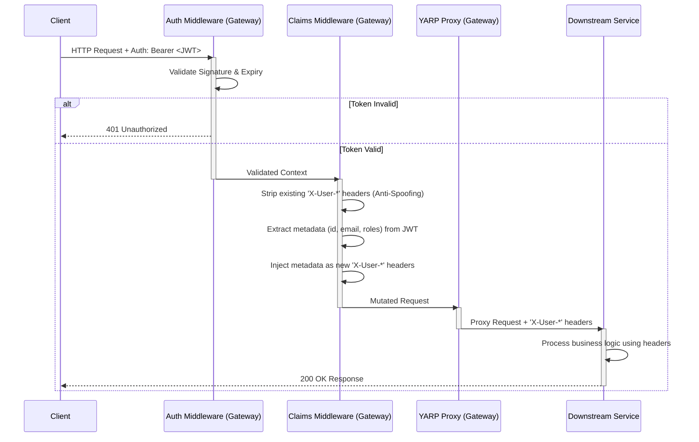

# LLD: Propagate User Metadata to Downstream Services (RR-352)

## 1. Objective

The purpose of this component is to implement a Claims Transformation layer within the API Gateway. It extracts validated user metadata (claims) from incoming JSON Web Tokens (JWTs) and propagates them as trusted, plain-text HTTP headers to downstream microservices. This decouples downstream services from JWT validation logic and cryptography while maintaining a zero-trust boundary.

## 2. Technology Stack

* **Component:** API Gateway
* **Framework:** ASP.NET Core (Middleware Pipeline)
* **Reverse Proxy:** YARP (Yet Another Reverse Proxy)
* **Auth Protocol:** JWT (JSON Web Tokens) via Bearer scheme

## 3. Architecture & Diagrams

### 3.1 Sequence Diagram

This diagram outlines the exact lifecycle of an incoming request as it passes through the Gateway's security layers.



### 3.2 System API Flow (Header Injection)

The Gateway acts as an interceptor, transforming the payload envelope before it crosses the internal network boundary.

* **Inbound (Untrusted Network):** `Authorization: Bearer eyJhbGci...`
* **Internal (Trusted Network):** `X-User-Id: 33df0e75...`, `X-User-Email: user@example.com`

## 4. Component Design & Pseudo-Code

The core logic will be implemented as asynchronous, inline middleware function executed immediately prior to the reverse proxy handoff.

### Pseudo-Code

```text
FUNCTION ClaimsTransformationMiddleware(Request, NextMiddleware):

    // Step 1: Security - Sanitize incoming request (Anti-Spoofing)
    REMOVE_HEADER(Request, "X-User-Id")
    REMOVE_HEADER(Request, "X-User-Email")
    REMOVE_HEADER(Request, "X-User-Roles")

    // Step 2: Verify Authorization State
    IF Request.Context.IsAuthenticated == TRUE:
        
        // Step 3: Extract Claims from Token Payload
        userId = GET_CLAIM(Request.Context.Token, "id")
        email = GET_CLAIM(Request.Context.Token, "email")
        roles = GET_CLAIM(Request.Context.Token, "roles")

        // Step 4: Propagate via Internal Headers
        IF userId IS NOT EMPTY:
            SET_HEADER(Request, "X-User-Id", userId)
            
        IF email IS NOT EMPTY:
            SET_HEADER(Request, "X-User-Email", email)
            
        IF roles IS NOT EMPTY:
            SET_HEADER(Request, "X-User-Roles", roles)

    END IF

    // Step 5: Yield execution to proxy (YARP)
    CALL NextMiddleware()

END FUNCTION

```

## 5. Security Considerations

* **Header Spoofing:** Malicious actors may attempt to bypass Gateway authorization by injecting target headers (e.g., `X-User-Id: admin-id`) into their original HTTP request. The middleware explicitly neutralizes this threat by aggressively deleting any predefined `X-User-*` headers *before* applying the trusted claims extracted from the JWT.
* **Header Size Limits:** Propagated headers will be strictly limited to essential metadata (ID, Email, Roles) to prevent HTTP Header Size limit exhaustion (typically 8KB - 16KB depending on the internal web server).

## 6. Downstream API Contract (Internal)

All downstream microservices must adhere to the following internal header contract to identify the calling user.

| Header Name | Data Type | Source Claim | Nullable | Description |
| --- | --- | --- | --- | --- |
| `X-User-Id` | UUID/String | `id` | False | Unique identifier of the authenticated user. |
| `X-User-Email` | String | `email` | False | Email address of the authenticated user. |
| `X-User-Roles` | String | `roles` | True | Comma-separated list of RBAC roles. |