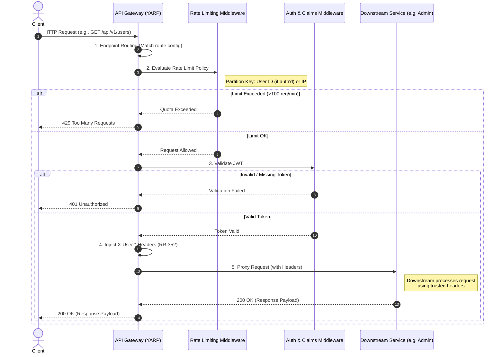

# LLD: RR-353 API Gateway Rate Limiting (Throttling)

## 1. Executive Summary

To ensure the stability, availability, and fair usage of the RAGFlow platform, we are introducing a Rate Limiting (Throttling) mechanism at the API Gateway level. This acts as a perimeter defense to protect downstream microservices from accidental traffic spikes, abusive scraping, and denial-of-service (DDoS) attempts by enforcing strict quota limits per user or IP address.

## 2. Architectural Strategy

We are implementing a **Partitioned Fixed Window** rate-limiting algorithm.

Instead of a global limit (where one malicious user could consume the entire platform's quota), the gateway will create isolated traffic "partitions" for every requester.

* **Algorithm:** Fixed Window (e.g., 100 requests per 1-minute window).
* **Partition Key Resolution:**
* **Authenticated Users:** The gateway will parse the JWT and track requests by the `User ID`.
* **Anonymous Users:** The gateway will track requests by the client's `IP Address`.

* **Rejection Behavior:** Requests exceeding the limit will be blocked at the gateway and immediately receive an **HTTP 429 (Too Many Requests)** response.

## 3. Proposed Configurations

The initial configuration will establish a baseline that allows normal application usage while preventing aggressive automated scripts.

| Policy Name | Scope | Limit | Window | Queue Limit |
| --- | --- | --- | --- | --- |
| `StandardPolicy` | Global APIs (`/datasets`, etc.) | 100 | 1 Minute | 0 (Instant Rejection) |
| `StrictPolicy` | Sensitive APIs (`/login`, `/signup`) | 5 | 1 Minute | 0 (Instant Rejection) |

*Note: Queue Limit is set to 0 to prevent the Gateway's memory from filling up with queued requests during a sustained attack.*

---

## 4. Sequence Flow

The following diagram and flow illustrate the request lifecycle through the API Gateway pipeline after the introduction of explicit routing and rate limiting.

## 5. Key Architectural Decisions

* **Explicit Pipeline Ordering:** We are refactoring the ASP.NET pipeline to use explicit routing. The Rate Limiter must execute *after* Routing (so it knows which policy to apply) but *before* Authentication/Authorization (to drop malicious traffic before spending CPU cycles on cryptographic token validation).
* **In-Memory vs. Distributed Tracking:** For this iteration, rate-limiting counters will be stored in-memory within the API Gateway instance.
* **Trade-off (Simplicity vs. Volatility):** We chose in-memory tracking to prioritize high-speed execution and zero-configuration deployment. The accepted disadvantage is that container restarts will wipe the rate-limit memory, resetting the counters for any currently blocked users.
* **Future Iteration:** If strict global limits are required across multiple Gateway instances, we will migrate the tracking store to a distributed Redis cache.

## 6. Impact and Observability

* **Downstream Impact:** Downstream services will see a reduction in anomalous traffic spikes. No code changes are required in downstream services (Python/Node/Java) to support this feature.
* **Monitoring:** The API Gateway will log `429` responses. We will configure our monitoring dashboard to alert the infrastructure team if a specific IP or User ID triggers an unusually high number of `429` responses, indicating a potential targeted attack.