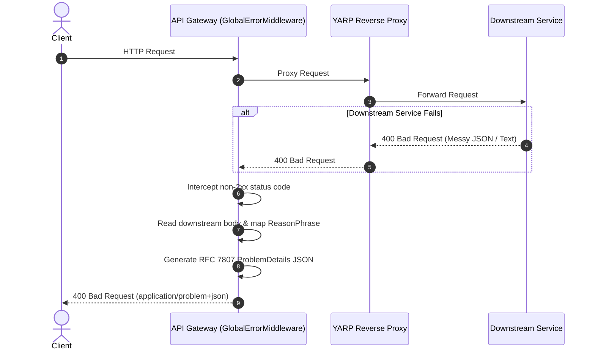

# LLD: RR-354 Standardize Error Response Structure

## 1. Executive Summary

Currently, downstream microservices in the RAGFlow architecture return varying error formats (e.g., plain text, missing bodies, or inconsistent JSON schemas) when a request fails. This creates significant overhead for frontend clients parsing errors. This ticket implements a centralized **Global Error Handling Middleware** at the API Gateway level to intercept all failed HTTP responses and standardize them into a unified format based on the **RFC 7807 (Problem Details for HTTP APIs)** specification.

## 2. Architectural Strategy

The API Gateway will act as the normalization layer for all HTTP error responses, ensuring compliance with the Single Responsibility Principle (SRP) by encapsulating this logic in a dedicated middleware class.

* **Mechanism:** A custom ASP.NET Core Middleware class (`GlobalErrorMiddleware.cs`).
* **Scope:** * Gateway-level rejections (e.g., 401 Unauthorized, 429 Too Many Requests).
* Downstream microservice errors (e.g., 400 Bad Request, 500 Internal Server Error) returned via YARP.


* **Standardized Schema (RFC 7807):** Every error response will guarantee the following JSON structure:
* `status`: The HTTP status code.
* `title`: A human-readable summary of the problem type (dynamically mapped via `ReasonPhrases`).
* `detail`: The specific explanation of the error (extracted from downstream response or a safe fallback).
* `traceId`: A unique correlation ID for infrastructure observability.


## 3. Standardized JSON Payload (RFC 7807)

Regardless of the failing microservice, the client will always receive a strictly typed `application/problem+json` payload matching this structure:

```json
{
  "status": 400,
  "title": "Bad Request",
  "detail": "Password must contain at least one uppercase letter and one number.",
  "traceId": "0HN2T8QG1B5C3:00000001"
}

```

## 4. Sequence Flow



## 5. Key Architectural Decisions

* **Decoupled Middleware Class:** Error handling logic is extracted from `Program.cs` into `GlobalErrorMiddleware.cs` to maintain clean startup configurations and allow for isolated unit testing.
* **Dynamic Title Mapping:** Status code titles are dynamically generated using ASP.NET Core's built-in `ReasonPhrases.GetReasonPhrase()`, preventing hardcoded switch statements and future-proofing against new HTTP status codes.
* **Downstream Error Preservation:** The middleware buffers the response stream to extract and preserve any meaningful `detail` strings generated by downstream microservices (Node/Python/Java) before overwriting the overarching JSON schema.

## 6. Frontend Integration & Consumption Guide

To fully leverage this standardized architecture, Frontend teams (React, Angular, Vue) should implement a **Global HTTP Interceptor** (e.g., via Axios Interceptors or Angular `HttpInterceptor`).

**Recommended FE Implementation Steps:**

1. **Define a strict interface/type** matching the `ProblemDetails` schema (`status`, `title`, `detail`, `traceId`).
2. **Configure the Global Interceptor** to catch all HTTP errors globally.
3. **Extract the `detail` property** from the standardized payload and map it directly to UI notification components (Toast/Snackbar messages).
4. **Log the `traceId**` to the browser console or monitoring tool (e.g., Sentry) to streamline DevOps debugging.

By centralizing error handling in a frontend interceptor, individual UI components will no longer require local `try/catch` logic for standard API failures.