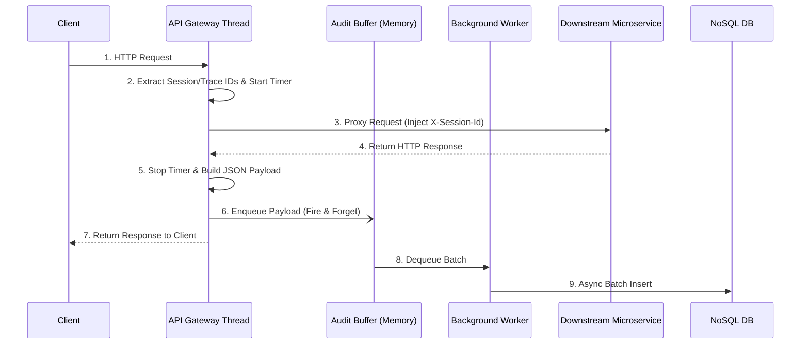

# Low-Level Design (LLD): Centralized Request/Response Logging and Auditing

## 1. Overview

* **Feature/Ticket:** RR-355
* **Description:** Implement centralized, non-blocking audit logging at the API Gateway. Capture user activity, session context, and routing metrics. Persist asynchronously to a NoSQL database for zero API latency impact.
* **Dependencies:** Upstream authentication middleware (provides User/Tenant/Session IDs) and a NoSQL datastore (e.g., MongoDB, Elasticsearch).

## 2. Component Architecture

* **Audit Interceptor (Producer):** Middleware that captures request/response metadata, injects tracing headers, and immediately enqueues the log payload.
* **Audit Buffer (Queue):** A thread-safe, in-memory bounded channel. Decouples HTTP threads from database I/O.
* **Audit Worker (Consumer):** A continuous background service that drains the buffer and performs batch inserts into the NoSQL DB.

## 3. Events & Payload

**Triggers:** Payload generated on successful requests (2xx/3xx), errors (4xx/5xx), or Gateway exceptions.
**NoSQL Document Schema:**

* **`EventId`**: UUID for the log entry.
* **`Timestamp`**: UTC completion time.
* **`TraceId`**: Correlation ID for distributed tracing.
* **`UserContext`**: Object containing `UserId`, `TenantId`, `SessionId`, and `ClientIp`.
* **`RequestDetails`**: Object containing HTTP `Method`, `Path`, and `QueryString`.
* **`ResponseDetails`**: Object containing HTTP `StatusCode` and `DurationMs`.
*(Note: Request/Response body payloads are strictly excluded to protect PII/PHI).*

## 4. Interfaces & Contracts

* **Buffer Interface:** Fire-and-forget enqueue method (non-blocking).
* **Database Interface:** Async batch-insert method (minimizes network calls).
* **Header Propagation:** Gateway injects `X-Session-Id` into outgoing downstream requests for cross-service tracking.

## 5. Sequence Flow

## 6. Error Handling

* **DB Outage:** Worker utilizes exponential backoff-and-retry. The buffer holds logs until the DB recovers.
* **Buffer Overflow:** If the queue reaches max capacity, the system logs a metric alert and drops the oldest entries to prevent Gateway memory exhaustion.

## 7. Non-Functional Requirements (NFRs)

* **Performance:** Zero-lag guarantee. DB insertion latency does not impact client response time.
* **Scalability:** Horizontally scalable; multiple gateway nodes can write to the sharded NoSQL DB without lock contention.
* **Traceability:** Standardized `SessionId` and `TraceId` headers ensure full lifecycle observability across all microservices.