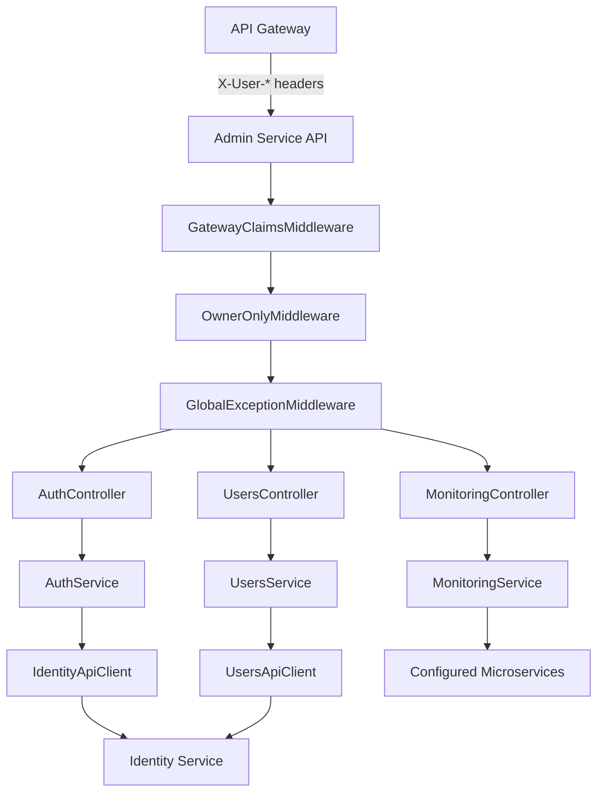
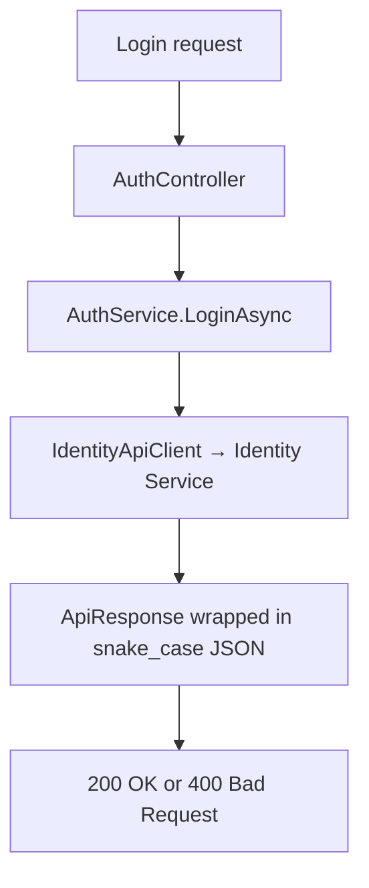

# Admin Service

The Admin Service is an ASP.NET Core Web API that provides super-admin capabilities for the Ragflow platform: authentication proxying, user management, and cross-service platform health monitoring. It acts as a BFF-style admin layer, delegating auth and user operations to the Identity Service while enforcing gateway-based identity claims and Owner-only authorization [src: backend/dotnet-services/admin-service/AdminService.API/Program.cs:L37-L68] [src: backend/dotnet-services/admin-service/AdminService.Infrastructure/DependencyInjection.cs:L16-L30].

## Overview

The solution follows a layered architecture:

| Layer | Project | Responsibility |
|---|---|---|
| **API** | `AdminService.API` | HTTP controllers, middleware pipeline, Swagger, health checks [src: backend/dotnet-services/admin-service/AdminService.API/Program.cs:L130-L150] |
| **Core** | `AdminService.Core` | Service interfaces and shared constants [src: backend/dotnet-services/admin-service/AdminService.Core/Interfaces/IAuthService.cs] |
| **Domain** | `AdminService.Domain` | DTOs and API response wrappers [src: backend/dotnet-services/admin-service/AdminService.Domain/DTOs/ApiResonse.cs] |
| **Infrastructure** | `AdminService.Infrastructure` | HTTP clients, service implementations [src: backend/dotnet-services/admin-service/AdminService.Infrastructure/Clients/IdentityApiClient.cs] |

### Controllers

| Controller | Responsibility |
|---|---|
| **AuthController** | Login, refresh token, and logout — proxied to Identity Service [src: backend/dotnet-services/admin-service/AdminService.API/Controllers/AuthController.cs:L26-L79] [src: backend/dotnet-services/admin-service/AdminService.Infrastructure/Services/AuthService.cs:L15-L43] |
| **UsersController** | Paginated user listing, user details, enable/disable, and tenant membership — proxied to Identity Service [src: backend/dotnet-services/admin-service/AdminService.API/Controllers/UsersController.cs:L27-L134] [src: backend/dotnet-services/admin-service/AdminService.Infrastructure/Services/UsersService.cs:L15-L50] |
| **MonitoringController** | Aggregated platform health by probing configured downstream services [src: backend/dotnet-services/admin-service/AdminService.API/Controllers/MonitoringController.cs:L27-L43] [src: backend/dotnet-services/admin-service/AdminService.Infrastructure/Services/MonitoringService.cs:L22-L94] |

### Middleware pipeline

Requests pass through middleware in this order [src: backend/dotnet-services/admin-service/AdminService.API/Program.cs:L142-L144]:

1. **GatewayClaimsMiddleware** — Reads `X-User-Id`, `X-User-Email`, and `X-User-Roles` headers from the API Gateway and builds a claims principal; rejects requests missing identity headers [src: backend/dotnet-services/admin-service/AdminService.API/Middlewares/GatewayClaimsMiddleware.cs:L37-L71].
2. **OwnerOnlyMiddleware** — Restricts access to users with the `Owner` role; auth endpoints are exempt [src: backend/dotnet-services/admin-service/AdminService.API/Middlewares/OwnerOnlyMiddleware.cs:L25-L58].
3. **GlobalExceptionMiddleware** — Centralized exception handling [src: backend/dotnet-services/admin-service/AdminService.API/Middlewares/GlobalExceptionMiddleware.cs].

## Framework & stack

| Layer | Technology |
|---|---|
| Runtime | .NET 10 (`net10.0`) [src: backend/dotnet-services/admin-service/AdminService.API/AdminService.API.csproj:L3] |
| Web framework | ASP.NET Core Web API [src: backend/dotnet-services/admin-service/AdminService.API/AdminService.API.csproj:L1] |
| API versioning | `Asp.Versioning.Mvc` (default v1.0) [src: backend/dotnet-services/admin-service/AdminService.API/Program.cs:L13-L18] [src: backend/dotnet-services/admin-service/AdminService.API/AdminService.API.csproj:L9] |
| OpenAPI | Swashbuckle (Development only) [src: backend/dotnet-services/admin-service/AdminService.API/Program.cs:L134-L138] [src: backend/dotnet-services/admin-service/AdminService.API/AdminService.API.csproj:L11] |
| JSON serialization | Snake-case lower property naming [src: backend/dotnet-services/admin-service/AdminService.API/Program.cs:L40-L43] |
| HTTP clients | `IHttpClientFactory` for Identity Service and monitoring probes [src: backend/dotnet-services/admin-service/AdminService.API/Program.cs:L19] [src: backend/dotnet-services/admin-service/AdminService.Infrastructure/DependencyInjection.cs:L17-L26] |

> **Note:** `FACTS.md` reports the detected stack as `JAVA_SPRING_BOOT`, which does not match the ASP.NET Core implementation [src: backend/dotnet-services/admin-service/docs/facts/FACTS.md:L4-L5].

## Dependencies

### NuGet packages

| Package | Purpose |
|---|---|
| `Asp.Versioning.Mvc` | URI-based API versioning [src: backend/dotnet-services/admin-service/AdminService.API/AdminService.API.csproj:L9] |
| `Microsoft.AspNetCore.Authentication.JwtBearer` | JWT bearer authentication support [src: backend/dotnet-services/admin-service/AdminService.API/AdminService.API.csproj:L10] |
| `Swashbuckle.AspNetCore` | Swagger/OpenAPI documentation [src: backend/dotnet-services/admin-service/AdminService.API/AdminService.API.csproj:L11] |

### Downstream services

Service URLs are loaded from `config/services.json` at startup and registered as named HTTP clients [src: backend/dotnet-services/admin-service/AdminService.API/Program.cs:L105-L121].

Shared monorepo service registry:

| Service | Base URL |
|---|---|
| IdentityService | `http://identity-service:3000` |
| AdminService | `http://admin-auth-service:3000` |
| DatasetService | `http://dataset-service:3000` |
| DocumentService | `http://document-service:3000` |
| ParserService | `http://parser-service:3000` |

[src: backend/shared/services.json:L2-L8]

Both `IdentityApiClient` and `UsersApiClient` use `Services:IdentityService` as their base address [src: backend/dotnet-services/admin-service/AdminService.Infrastructure/DependencyInjection.cs:L17-L26].

### Container runtime

The Docker image exposes port 3000 with `ASPNETCORE_URLS=http://+:3000` [src: backend/dotnet-services/admin-service/Dockerfile:L29-L33].

## Architecture

### Auth proxy flow

Implemented in `AuthController`, `AuthService`, and `IdentityApiClient` [src: backend/dotnet-services/admin-service/AdminService.API/Controllers/AuthController.cs:L26-L38] [src: backend/dotnet-services/admin-service/AdminService.Infrastructure/Services/AuthService.cs:L15-L22] [src: backend/dotnet-services/admin-service/AdminService.Infrastructure/Clients/IdentityApiClient.cs:L18-L29].

## Related documentation

- [API Reference](./api-reference.md) — routes documented from `FACTS.md`
- [Configuration](./config.md) — environment variables from `FACTS.md`
- [Ground Truth Facts](./facts/FACTS.md) — authoritative facts pack

## ⚠️ To Verify

- [ ] Re-run `node tools/extract-facts.mjs backend/dotnet-services/admin-service` after fixing stack detection (`JAVA_SPRING_BOOT` misidentified a .NET service) so routes and config keys populate `FACTS.md` [src: backend/dotnet-services/admin-service/docs/facts/FACTS.md:L4-L11].
- [ ] `system-architecture.json` was not found in the repository; global architecture context could not be loaded.
- [ ] `config/services.json` is required at startup (`optional: false`) but was not found in the repository — confirm deployment packaging [src: backend/dotnet-services/admin-service/AdminService.API/Program.cs:L105].
- [ ] Route paths on controllers and health-check mappings are not present in `FACTS.md` and are omitted from the API reference per documentation rules.
- [ ] JWT settings in `appsettings.json` (`Issuer`, `Audience`, `Secret`, token lifetimes) are not listed in `FACTS.md` [src: backend/dotnet-services/admin-service/AdminService.API/appsettings.json:L9-L15].
