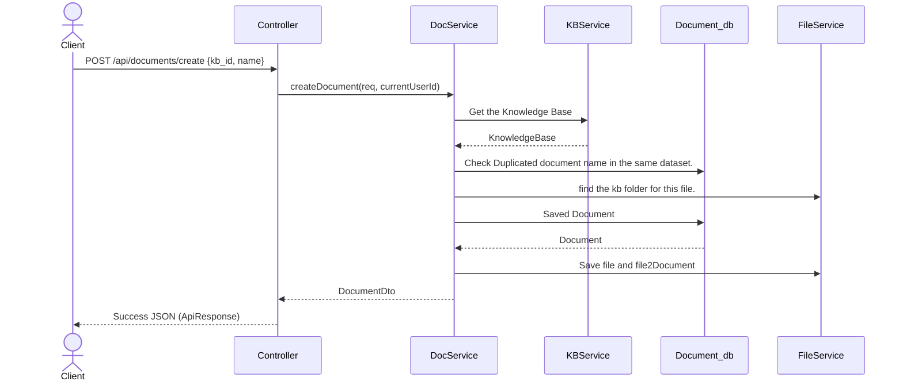
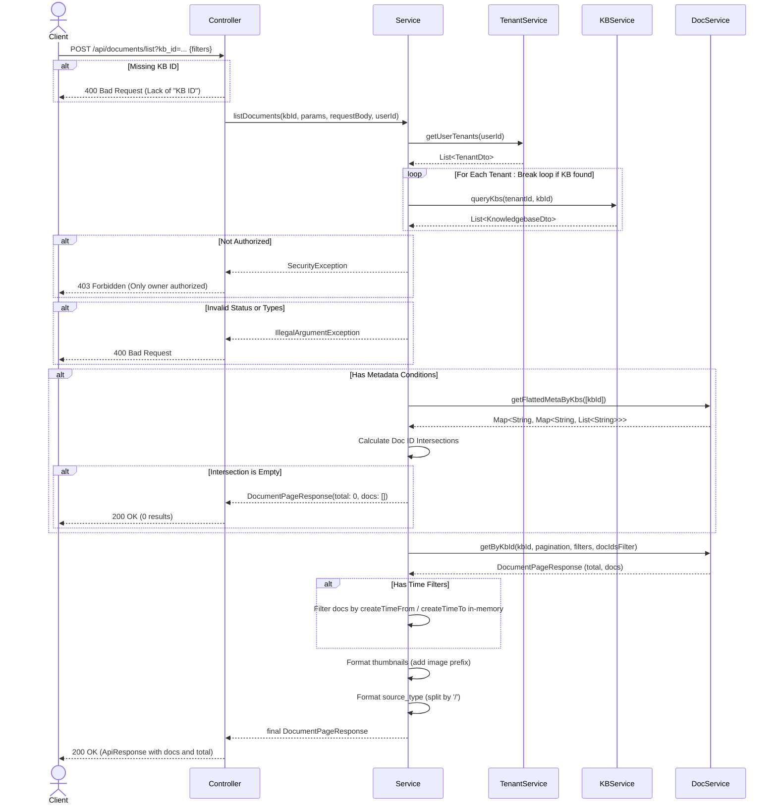
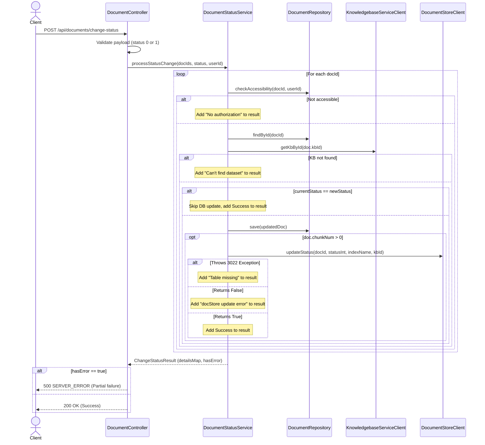
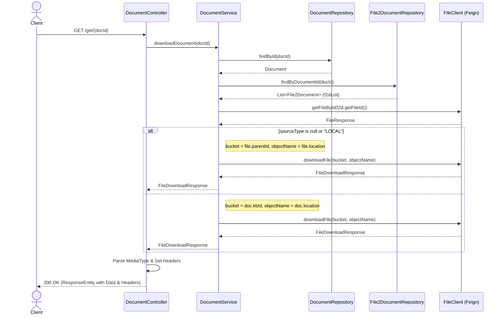

## **Low-Level Design (LLD) Document**

# 1\. Overview

The `DocumentController` handles the ingestion, management, metadata processing, and state manipulation of documents within the RAG pipeline. It has been refactored from a monolithic controller to a decentralized orchestrator that relies on external microservices (`KnowledgebaseService`, `FileService`) for core domain logic.

 Document Service

* Create/update/delete document metadata; link files to documents and to a KB.  
* Trigger parsing (call parsing-service) and RAG indexing (call rag-service).  
* Track document and chunk job status.  
* **Data**: Document and chunk metadata (and possibly job queue); actual blob storage via file-service.

# 2\. Architectural Context

* **Document Microservice**: Owns the document lifecycle, metadata updates, status changes, and parser assignments.  
* **Knowledgebase Microservice (External)**: Owns datasets, tenant permissions, and RBAC (Role-Based Access Control). Used for authorization checks before modifying a document.  
* **File Microservice (External)**: Owns binary blob storage, virtual folder structures, parsing delegation, and format conversion.

 Inter-Service Communication

* **Sync**: REST (JSON) for most CRUD and query flows.  
* **Async** (optional): Events (e.g. “document.parsed”, “chunk.indexed”) for parsing and RAG pipeline; can use Redis Streams or a message broker later.  
* **Identity**: Services accept JWT or a signed “user-id/tenant-id” header set by the gateway or identity-service.  
* Prefer **eventual consistency** across services; avoid distributed transactions.  
* Implement **document-service** (Java/Go/Node.js): document metadata CRUD; link file ↔ document ↔ KB. “Start parsing” and “Start indexing” trigger: call parsing-service and rag-service (or stub them until Phase 3).  
* **No shared foreign keys** across services: references use IDs (e.g. `tenant_id`, `kb_id`, `document_id`). Referential integrity is not enforced across DBs.  
* **Data migration**: If you need to migrate existing data from the current RAGFlow DB:  
  * Export data per table group (per service).  
  * Import into the corresponding service database in the new repo’s environment.  
  * Run services against the new DBs; no monolith in the new repo.

# 3\. Key Components & Class Interactions

* **`DocumentController`**: Entry point for all HTTP REST traffic mapping to `/v1/document`.  
* **`DocumentService` (Local Bean)**: Contains local business logic (e.g., Elasticsearch index updating, database transactions for renaming or state manipulation).  
* **`KnowledgebaseServiceClient` (@FeignClient)**: Synchronous RPC proxy mapping to the KB service to validate `kb_id`, fetch configurations, and check `current_user.id` authorization.  
* **`FileServiceClient` (@FeignClient)**: Synchronous/Asynchronous proxy handling chunk storage operations, PDF extraction, and heavy I/O operations previously monolithic.  
* Each table is assigned to **exactly one** service. That service is the only one that reads/writes it.  
* **document-service:** `document`(Document lifecycle), `file2document`(file–document link), `task`(processing tasks), `pipeline_operation_log`(logs)  
* Per-Service Database Summary  
  * Service: document-service  
  * Database name (example): `document_db`  
  * Tables count: 4  
  * Stores: document, file2document, task, pipeline\_operation\_log  
* **References only by ID**: Services store `tenant_id`, `user_id`, `kb_id`, `document_id`, `dialog_id`, etc. as plain strings. They do **not** create foreign keys to another service’s database.  
* **Resolve via API**: If identity-service needs to validate `tenant_id`, it uses its own DB. If a document-service needs to check “does this kb\_id exist?”, it can call knowledge-base-service API (or trust the gateway/validation).  
* **Consistency**: Eventual. When a tenant is deleted in identity-service, other services may still have rows referencing that `tenant_id` until you run cleanup jobs or listen for “tenant.deleted” events.  
* **Duplicate/cache**: Services may cache minimal data (e.g. tenant name) from another service’s API; no shared DB access.

# 4\. API Contract (Endpoints, Requests, Responses, Status Codes)

**Routing table**:  
`/v1/document*`, `/v1/chunk*`, `/v1/file2document*` → document-service.

## Document

Here is the detailed API contract for the DocumentController. This contract covers the request payloads, parameters, and all conditional response cases mapped to appropriate HTTP status codes based on the original monolithic logic.

**Base URL Context:** /v1/document

**Common Headers:** All endpoints (except where noted) require authentication, represented here by an X-User-Id or Authorization: Bearer \<token\>.

### **POST /upload**

Uploads one or more files to a specific knowledge base.

* **Content-Type:** multipart/form-data  
* **Request Body:**  
  * kb\_id (String, required): Target Knowledge Base ID.  
  * file (File Array, required): List of files to upload.

| Status Code | Scenario | Response Body / Definition |
| :---- | :---- | :---- |
| **200 OK** | Successful upload. | {"code": 200, "data": \["doc\_id\_1", "doc\_id\_2"\]} |
| **400 Bad Request** | Missing kb\_id. | {"code": 400, "message": "Lack of 'KB ID'", "data": false} |
| **400 Bad Request** | No files or empty filename provided. | {"code": 400, "message": "No file part\! / No file selected\!", "data": false} |
| **400 Bad Request** | File name exceeds byte limit. | {"code": 400, "message": "File name must be \[LIMIT\] bytes or less.", "data": false} |
| **401 Unauthorized** | User lacks permission for kb\_id. | {"code": 401, "message": "No authorization.", "data": false} |
| **500 Server Error** | Upload failed / corrupted file. | {"code": 500, "message": "Issue with file format... / \[Error Stack\]", "data": \[\]} |

### 

### **POST /web\_crawl**	

Crawls a provided URL and saves it as a PDF document.

* **Content-Type:** application/json  
* **Request JSON:** {"kb\_id": "string", "name": "string", "url": "string"}

| Status Code | Scenario | Response Body / Definition |
| :---- | :---- | :---- |
| **200 OK** | Successfully crawled and saved. | {"code": 200, "data": true} |
| **400 Bad Request** | Missing kb\_id or invalid URL. | {"code": 400, "message": "Lack of 'KB ID' / URL format invalid", "data": false} |
| **401 Unauthorized** | User lacks permission. | {"code": 401, "message": "No authorization.", "data": false} |
| **404 Not Found** | Knowledge base not found. | {"code": 404, "message": "Can't find this dataset\!", "data": null} |
| **500 Server Error** | Download failure or unsupported file. | {"code": 500, "message": "\[Error message\]", "data": false} |

### 

### **POST /create**

Creates a virtual/empty document placeholder in a dataset.


__
* **Content-Type:** application/json  
* **Request JSON:** {"kb\_id": "string", "name": "string"}

| Status Code | Scenario | Response Body / Definition |
| :---- | :---- | :---- |
| **200 OK** | Document created successfully. | {"code": 200, "data": {"id": "...", "name": "...", "type": "virtual", ...}} |
| **400 Bad Request** | Missing kb\_id, empty name, or too long. | {"code": 400, "message": "File name can't be empty.", "data": false} |
| **400 Bad Request** | Duplicate document name in KB. | {"code": 400, "message": "Duplicated document name...", "data": false} |
| **404 Not Found** | KB or root folder missing. | {"code": 404, "message": "Can't find this dataset\!", "data": null} |
| **500 Server Error** | Database/Insertion error. | {"code": 500, "message": "\[Error message\]", "data": false} |

### 

### **POST /upload\_and\_parse**

Uploads files directly linked to a specific conversation context.

* **Content-Type:** multipart/form-data  
* **Request Body:** conversation\_id (String), file (File Array)

| Status Code | Scenario | Response Body / Definition |
| :---- | :---- | :---- |
| **200 OK** | Successfully uploaded and queued. | {"code": 200, "data": \["doc\_id\_1"\]} |
| **400 Bad Request** | Missing conversation ID or files. | {"code": 400, "message": "No file part\!", "data": false} |

### 

### **POST /parse**

Parses text from a given URL or uploaded files directly, returning extracted text without saving to a KB.

* **Content-Type:** application/json OR multipart/form-data  
* **Request JSON/Form:** {"url": "string"} OR file (File Array)

| Status Code | Scenario | Response Body / Definition |
| :---- | :---- | :---- |
| **200 OK** | Successfully parsed text sections. | {"code": 200, "data": "Parsed text block line 1\\nLine 2..."} |
| **400 Bad Request** | Invalid URL or missing files. | {"code": 400, "message": "URL format is invalid / No file", "data": false} |

## 

### **POST /list**

Retrieves a paginated list of documents based on complex filters.



* **Query Params:** kb\_id (required), page (int), page\_size (int), orderby (string), desc (bool), keywords (string), create\_time\_from (int), create\_time\_to (int)  
* **Request JSON:** {"run\_status": \["1", "2"\], "types": \["pdf"\], "suffix": \[".pdf"\], "metadata\_condition": {...}, "metadata": {...}, "return\_empty\_metadata": false}

| Status Code | Scenario | Response Body / Definition |
| :---- | :---- | :---- |
| **200 OK** | Successfully fetched list. | {"code": 200, "data": {"total": 5, "docs": \[{...}\]}} |
| **400 Bad Request** | Invalid status, type, or metadata JSON. | {"code": 400, "message": "Invalid filter conditions...", "data": false} |
| **403 Forbidden** | User is not the owner of the dataset. | {"code": 403, "message": "Only owner authorized.", "data": false} |

### 

### **POST /filter**

Returns document filter aggregations and totals for a KB.

* **Request JSON:** {"kb\_id": "string", "keywords": "string", "suffix": \[\], "run\_status": \[\], "types": \[\]}

| Status Code | Scenario | Response Body / Definition |
| :---- | :---- | :---- |
| **200 OK** | Aggregations retrieved. | {"code": 200, "data": {"total": 100, "filter": {...}}} |
| **400 Bad Request** | Invalid KB ID, types, or run status. | {"code": 400, "message": "Invalid filter conditions...", "data": false} |

### 

### **POST /infos**

Fetches detailed info for an array of specific document IDs.

* **Request JSON:** {"doc\_ids": \["id1", "id2"\]}

| Status Code | Scenario | Response Body / Definition |
| :---- | :---- | :---- |
| **200 OK** | Information retrieved successfully. | {"code": 200, "data": \[{...doc info...}\]} |
| **401 Unauthorized** | User lacks access to one or more IDs. | {"code": 401, "message": "No authorization.", "data": false} |

### 

### **GET /thumbnails**

Retrieves base64 thumbnails or image URLs for specified documents.

* **Query Params:** doc\_ids (List of strings)

| Status Code | Scenario | Response Body / Definition |
| :---- | :---- | :---- |
| **200 OK** | Thumbnails returned as map. | {"code": 200, "data": {"doc\_id\_1": "base64\_string\_or\_url"}} |
| **400 Bad Request** | Missing doc\_ids. | {"code": 400, "message": "Lack of 'Document ID'", "data": false} |

## 

### **POST /metadata/update**

Batch updates or deletes custom metadata across multiple documents.

* **Request JSON:** {"kb\_id": "string", "selector": {"document\_ids": \[\], "metadata\_condition": {}}, "updates": \[{"key": "k", "value": "v"}\], "deletes": \[{"key": "k"}\]}

| Status Code | Scenario | Response Body / Definition |
| :---- | :---- | :---- |
| **200 OK** | Metadata updated. | {"code": 200, "data": {"updated": 2, "matched\_docs": 2}} |
| **400 Bad Request** | Invalid JSON structures / missing keys. | {"code": 400, "message": "Each update requires key...", "data": false} |
| **403 Forbidden** | User not owner of dataset. | {"code": 403, "message": "Only owner authorized.", "data": false} |

### **POST /change\_status**

Toggles document availability (e.g., enable/disable in semantic search).



* **Request JSON:** {"doc\_ids": \["id1"\], "status": "1"} (status must be "0" or "1")

| Status Code | Scenario | Response Body / Definition |
| :---- | :---- | :---- |
| **200 OK** | All statuses updated. | {"code": 200, "data": {"id1": {"status": "1"}}} |
| **400 Bad Request** | Status not 0 or 1\. | {"code": 400, "message": "'Status' must be either 0 or 1\!", "data": false} |
| **500 Server Error** | Partial failure (some DB/Elasticsearch fails). | {"code": 500, "message": "Partial failure", "data": {"id1": {"error": "..."}}} |

### 

### **POST /rm**

Deletes specified documents permanently.

* **Request JSON:** {"doc\_id": \["id1", "id2"\]}

| Status Code | Scenario | Response Body / Definition |
| :---- | :---- | :---- |
| **200 OK** | Documents deleted. | {"code": 200, "data": true} |
| **401 Unauthorized** | User lacks deletion rights. | {"code": 401, "message": "No authorization.", "data": false} |
| **500 Server Error** | Deletion process failed. | {"code": 500, "message": "Error trace", "data": false} |

### 

### **POST /run**

Starts or cancels the text extraction/parsing worker task.

* **Request JSON:** {"doc\_ids": \["id1"\], "run": "1", "delete": true, "apply\_kb": false} (run: "1" \= RUNNING, "3" \= CANCEL)

| Status Code | Scenario | Response Body / Definition |
| :---- | :---- | :---- |
| **200 OK** | Task enqueued or canceled successfully. | {"code": 200, "data": true} |
| **401 Unauthorized** | Lack of access to document. | {"code": 401, "message": "No authorization.", "data": false} |
| **400 Bad Request** | Cannot cancel a task not RUNNING. | {"code": 400, "message": "Cannot cancel a task...", "data": false} |

### 

### **POST /rename**

Renames a document (cannot change the file extension).

* **Request JSON:** {"doc\_id": "string", "name": "new\_name.pdf"}

| Status Code | Scenario | Response Body / Definition |
| :---- | :---- | :---- |
| **200 OK** | Successfully renamed. | {"code": 200, "data": true} |
| **400 Bad Request** | Extension change attempted or duplicate name. | {"code": 400, "message": "The extension... can't be changed", "data": false} |

### **POST /change\_parser**

Updates the parsing configuration or pipeline assigned to a document.

* **Request JSON:** {"doc\_id": "string", "parser\_id": "string", "pipeline\_id": "string", "parser\_config": {...}}

| Status Code | Scenario | Response Body / Definition |
| :---- | :---- | :---- |
| **200 OK** | Parser updated, chunk DB cleared if needed. | {"code": 200, "data": true} |
| **400 Bad Request** | Assigning picture parser to non-picture file. | {"code": 400, "message": "Not supported yet\!", "data": false} |

## 

### **GET /get/{doc\_id}**

Streams the actual document file contents back to the client.



* **Path Variable:** doc\_id  
* **Response:** Raw binary file stream.

| Status Code | Scenario | Response Body / Headers |
| :---- | :---- | :---- |
| **200 OK** | File streamed successfully. | Content-Type: application/pdf (or respective mime), Body: \<Binary Data\> |
| **404 Not Found** | Document ID not found in DB. | {"code": 404, "message": "Document not found\!", "data": null} |
| **500 Server Error** | Storage retrieval failure. | {"code": 500, "message": "...", "data": null} |

### 

### **GET /download/{attachment\_id}**

Streams an attachment file (like Markdown conversions).

* **Path Variable:** attachment\_id  
* **Query Params:** ext (string, defaults to 'markdown')

| Status Code | Scenario | Response Body / Headers |
| :---- | :---- | :---- |
| **200 OK** | Streamed successfully. | Content-Type: application/markdown, Body: \<Binary Data\> |
| **500 Server Error** | Storage failure. | Standard JSON error wrapper. |

### 

### **GET /image/{image\_id}**

Returns a generated image (e.g., chunk thumbnail).

* **Path Variable:** image\_id (format: bucket-name)

| Status Code | Scenario | Response Body / Headers |
| :---- | :---- | :---- |
| **200 OK** | Image retrieved. | Content-Type: image/JPEG, Body: \<Binary Data\> |
| **400 Bad Request** | Malformed image\_id parameter. | {"code": 400, "message": "Image not found.", "data": null} |

### **POST /upload\_info**

*(Note: Your frontend snippet maps upload\_and\_parse to this endpoint)*

Extracts and returns preliminary upload information or parsed metadata from a file or a URL before officially processing it into a knowledge base.

* **Content-Type:** multipart/form-data  
* **Request Payload:**  
  * file (File, optional): A single file part.  
* **Query Parameters:**  
  * url (String, optional): URL to fetch info from if a file is not provided.

| Status Code | Scenario | Response Body / Definition |
| :---- | :---- | :---- |
| **200 OK** | Successfully retrieved file/URL info. | {"code": 200, "data": {"title": "...", "size": 1024, "type": "pdf", ...}} |
| **500 Server Error** | Processing failure (e.g., unreachable URL or corrupted file). | {"code": 500, "message": "\[Error Stack\]", "data": null} |

### 

### **POST /set\_meta**

Sets or updates custom metadata fields (meta\_fields) for a specific document. The metadata must be provided as a stringified JSON object.

* **Content-Type:** application/json  
* **Request JSON:** {"doc\_id": "string", "meta": "{\\"key1\\": \\"value1\\", \\"key2\\": \[1, 2, 3\]}"}

| Status Code | Scenario | Response Body / Definition |
| :---- | :---- | :---- |
| **200 OK** | Metadata successfully updated. | {"code": 200, "data": true} |
| **400 Bad Request** | meta is not valid JSON. | {"code": 400, "message": "Json syntax error: ...", "data": false} |
| **400 Bad Request** | meta is not a dictionary. | {"code": 400, "message": "Meta data should be in Json map format...", "data": false} |
| **400 Bad Request** | Values/lists contain unsupported types (must be string, int, or float). | {"code": 400, "message": "The type is not supported...", "data": false} |
| **401 Unauthorized** | User lacks access to the document. | {"code": 401, "message": "No authorization.", "data": false} |
| **404 Not Found** | Document ID does not exist. | {"code": 404, "message": "Document not found\!", "data": null} |
| **500 Server Error** | Database update failed. | {"code": 500, "message": "Database error (meta updates)\!", "data": false} |

### 

### **POST /metadata/summary**

*(Mapped to getMetaData in your frontend)*

Retrieves a summary aggregation of all custom metadata fields used across all documents within a specific Knowledge Base.

* **Content-Type:** application/json  
* **Request JSON:** {"kb\_id": "string"}

| Status Code | Scenario | Response Body / Definition |
| :---- | :---- | :---- |
| **200 OK** | Summary successfully generated. | {"code": 200, "data": {"summary": {"author": \["John", "Jane"\], "year": \[2023, 2024\]}}} |
| **400 Bad Request** | Missing kb\_id. | {"code": 400, "message": "Lack of 'KB ID'", "data": false} |
| **403 Forbidden** | User is not the owner/authorized tenant of the KB. | {"code": 403, "message": "Only owner of dataset authorized for this operation.", "data": false} |
| **500 Server Error** | Database/aggregation failure. | {"code": 500, "message": "\[Error message\]", "data": false} |

### 

### **POST /update\_metadata\_setting**

*(Mapped to documentUpdateMetaData in your frontend)*

Updates the parser configuration (parser\_config.metadata) for a specific document, dictating how the document's metadata should be treated during the chunking/parsing phase.

* **Content-Type:** application/json  
* **Request JSON:** {"doc\_id": "string", "metadata": {"enable": true, "fields": \[...\]}}

| Status Code | Scenario | Response Body / Definition |
| :---- | :---- | :---- |
| **200 OK** | Successfully updated. Returns the updated document object. | {"code": 200, "data": {"id": "...", "parser\_config": {"metadata": {...}}, ...}} |
| **401 Unauthorized** | User lacks access to the document. | {"code": 401, "message": "No authorization.", "data": false} |
| **404 Not Found** | Document ID does not exist. | {"code": 404, "message": "Document not found\!", "data": null} |

## File2Document

**Base URL Context:** /v1/file2document

**Common Headers:** All endpoints (except where noted) require authentication, represented here by an X-User-Id or Authorization: Bearer \<token\>.

### **POST /convert**

 Converts a list of uploaded files (or folders) into processable documents and attaches them to one or more specific Knowledge Bases. It cleans up any previous file-to-document mappings for the given files before creating new ones.

* **Content-Type:** application/json  
* **Request JSON:**

```json
{
  "file_ids": ["file_id_1", "file_id_2"],
  "kb_ids": ["kb_id_1", "kb_id_2"]
}
```

| Status Code | Scenario | Response Body / Definition |
| :---- | :---- | :---- |
| **200 OK** | Successfully converted and mapped files to KBs. | {"code": 200, "data": \[{"id": "...", "file\_id": "...", "document\_id": "..."}\]} |
| **400 Bad Request** | Missing file\_ids or kb\_ids in payload. | {"code": 400, "message": "Lack of 'file\_ids' / 'kb\_ids'", "data": false} |
| **404 Not Found** | A specified file, document, or tenant cannot be found during the cleanup/creation phase. | {"code": 404, "message": "File not found\! / Can't find this dataset\!", "data": null} |
| **500 Server Error** | Database error during document removal or insertion, or communication failure with external microservices. | {"code": 500, "message": "Database error (Document removal)\! / \[Error trace\]", "data": false} |

## Chunk

**Base URL Context:** /v1/document/chunk

**Common Headers:** X-User-Id (String, required for all endpoints to represent the logged-in user).

### **POST /list**

Retrieves a paginated list of parsed chunks for a specific document, optionally filtered by keyword search or availability status.

* **Content-Type:** application/json  
* **Request JSON:**

```json
{
  "doc_id": "string",
  "page": 1, 
  "size": 30,
  "keywords": "string", 
  "available_int": 1 
}
```

*(Note: page, size, keywords, and available\_int are optional).*

| Status Code | Scenario | Response Body |
| :---- | :---- | :---- |
| **200 OK** | Successfully retrieved chunks. | {"code": 200, "data": {"total": 50, "chunks": \[{"chunk\_id": "...", "content\_with\_weight": "...", "doc\_id": "...", "available\_int": 1, "positions": \[\]}\], "doc": { \<Document Object\> } }} |
| **400 Bad Request** | Tenant or Document not found. | {"code": 400, "message": "Tenant not found\! / Document not found\!", "data": false} |
| **400 Bad Request** | No chunks found in Vector DB. | {"code": 400, "message": "No chunk found\!", "data": false} |
| **500 Server Error** | Unexpected server/DB error. | {"code": 500, "message": "\[Error Stack\]", "data": false} |

### 

### **GET /get**

Fetches the raw data of a specific chunk by its ID. It automatically strips large embedding vectors and token arrays before returning the payload to save bandwidth.

* **Query Parameters:**  
  * chunk\_id (String, required): The ID of the chunk in the Vector DB.

| Status Code | Scenario | Response Body |
| :---- | :---- | :---- |
| **200 OK** | Chunk retrieved successfully. | {"code": 200, "data": {"id": "...", "content\_with\_weight": "...", "doc\_id": "...", "available\_int": 1}} |
| **400 Bad Request** | Tenant not found or Chunk not found in index. | {"code": 400, "message": "Tenant not found\! / Chunk not found\!", "data": false} |
| **500 Server Error** | Unexpected server error. | {"code": 500, "message": "\[Error Stack\]", "data": false} |

### 

### **POST /set**

Updates the text content or metadata of an existing chunk. This triggers a re-tokenization and re-embedding of the text in the background.

* **Content-Type:** application/json  
* **Request JSON:**

```json
{
  "doc_id": "string",
  "chunk_id": "string",
  "content_with_weight": "string",
  "important_kwd": ["keyword1"], 
  "question_kwd": ["question1"], 
  "tag_kwd": {"key": "value"}, 
  "tag_feas": {"key": "value"},
  "available_int": 1,
  "image_base64": "base64_string",
  "img_id": "bucket-filename"
}
```

*   
  *(Note: All fields except doc\_id, chunk\_id, and content\_with\_weight are optional).*

| Status Code | Scenario | Response Body |
| :---- | :---- | :---- |
| **200 OK** | Chunk updated and re-embedded successfully. | {"code": 200, "data": true} |
| **400 Bad Request** | Expected lists for keyword arrays. | {"code": 400, "message": "\\important\_kwd\` should be a list", "data": false}\` |
| **400 Bad Request** | Tenant or Document not found. | {"code": 400, "message": "Tenant not found\! / Document not found\!", "data": false} |
| **500 Server Error** | Vector encoding or DB update failure. | {"code": 500, "message": "\[Error Stack\]", "data": false} |

### 

### **POST /create**

Manually creates and inserts a new chunk into a document. This automatically generates the necessary embedding vectors.

* **Content-Type:** application/json  
* **Headers:** X-Request-ID (Optional, for logging/tracing).  
* **Request JSON:**

```json
{
  "doc_id": "string",
  "content_with_weight": "string",
  "important_kwd": [],
  "question_kwd": [],
  "tag_feas": {}
}
```

| Status Code | Scenario | Response Body |
| :---- | :---- | :---- |
| **200 OK** | Chunk created, embedded, and saved. | {"code": 200, "data": {"chunk\_id": "generated\_hash\_id"}} |
| **400 Bad Request** | Keyword fields are not arrays. | {"code": 400, "message": "\\important\_kwd\` is required to be a list", "data": false}\` |
| **400 Bad Request** | Missing related entities (Doc/Tenant/KB). | {"code": 400, "message": "Document not found\! / Tenant not found\!", "data": false} |
| **500 Server Error** | LLM Embedding failure or DB insert fail. | {"code": 500, "message": "\[Error Stack\]", "data": false} |

### 

### **POST /switch**

Toggles the availability status (enabled/disabled) of one or more chunks. Disabled chunks are ignored during semantic retrieval.

* **Content-Type:** application/json  
* **Request JSON:**

```json
{
  "doc_id": "string",
  "chunk_ids": ["chunk_id_1", "chunk_id_2"],
  "available_int": 1 
}
```

| Status Code | Scenario | Response Body |
| :---- | :---- | :---- |
| **200 OK** | Statuses updated successfully. | {"code": 200, "data": true} |
| **400 Bad Request** | Document missing or Vector DB update failed. | {"code": 400, "message": "Document not found\! / Index updating failure", "data": false} |
| **500 Server Error** | System error. | {"code": 500, "message": "\[Error Stack\]", "data": false} |

### 

### **POST /rm**

Permanently deletes specific chunks from the Vector DB and decrements the chunk count on the parent document.

* **Content-Type:** application/json  
* **Request JSON:**

```json
{
  "doc_id": "string",
  "chunk_ids": ["chunk_id_1", "chunk_id_2"]
}
```

* 

| Status Code | Scenario | Response Body |
| :---- | :---- | :---- |
| **200 OK** | Chunks successfully deleted. | {"code": 200, "data": true} |
| **400 Bad Request** | Document not found. | {"code": 400, "message": "Document not found\!", "data": false} |
| **400 Bad Request** | Elasticsearch/Vector DB failed to delete. | {"code": 400, "message": "Chunk deleting failure / Index updating failure", "data": false} |
| **500 Server Error** | System error. | {"code": 500, "message": "\[Error Stack\]", "data": false} |

### 

### **POST /retrieval\_test**

Tests the RAG retrieval pipeline by executing a query against the knowledge base, returning the highest-scoring chunks. This endpoint handles query expansion, cross-language translation, and cross-encoder reranking.

* **Content-Type:** application/json  
* **Request JSON:**

```json
{
  "kb_id": ["kb_id_1"],
  "question": "string",
  "page": 1,
  "size": 30,
  "doc_ids": ["doc_1"],
  "use_kg": false,
  "top_k": 1024,
  "cross_languages": ["en", "es"],
  "search_id": "string",
  "meta_data_filter": {},
  "similarity_threshold": 0.0,
  "vector_similarity_weight": 0.3,
  "rerank_id": "string",
  "keyword": false
}
```

| Status Code | Scenario | Response Body |
| :---- | :---- | :---- |
| **200 OK** | Retrieval successful. | {"code": 200, "data": {"chunks": \[{...}\], "labels": \["keyword1"\]}} |
| **400 Bad Request** | Dataset array is empty or KB missing. | {"code": 400, "message": "Please specify dataset firstly. / Knowledgebase not found\!", "data": false} |
| **400 Bad Request** | No chunks matched the criteria. | {"code": 400, "message": "No chunk found\! Check the chunk status please\!", "data": false} |
| **403 Forbidden** | User does not own/have access to the KB. | {"code": 403, "message": "Only owner of dataset authorized for this operation.", "data": false} |
| **500 Server Error** | Retrieval engine (Vector DB/LLM) failure. | {"code": 500, "message": "\[Error Stack\]", "data": false} |

### 

### **GET /knowledge\_graph**

Retrieves Knowledge Graph or Mind Map JSON representations associated with a specific document.

* **Query Parameters:**  
  * doc\_id (String, required): The ID of the document.

| Status Code | Scenario | Response Body |
| :---- | :---- | :---- |
| **200 OK** | Graph data successfully extracted. | {"code": 200, "data": {"graph": {\<JSON Object\>}, "mind\_map": {\<JSON Object\>}}} |
| **500 Server Error** | Retrieval failure. | {"code": 500, "message": "\[Error Stack\]", "data": false} |

# **5\. DB Design**

## Entity-Relationship Diagram (ERD)

![][image1]

## Data Dictionary

### **`pipeline_operation_log`**

**Purpose:** Serves as an audit trail and logging mechanism for document processing pipelines, tracking historical operations and their success/failure states.

```sql
CREATE TABLE pipeline_operation_log (
    id VARCHAR(32) PRIMARY KEY,
    document_id VARCHAR(32),
    tenant_id VARCHAR(32) NOT NULL,
    kb_id VARCHAR(32) NOT NULL,
    pipeline_id VARCHAR(32) NULL,
    pipeline_title VARCHAR(32) NULL,
    parser_id VARCHAR(32) NOT NULL,
    document_name VARCHAR(255) NOT NULL,
    document_suffix VARCHAR(255) NOT NULL,
    document_type VARCHAR(255) NOT NULL,
    source_from VARCHAR(255) NOT NULL,
    progress FLOAT DEFAULT 0,
    progress_msg TEXT DEFAULT '',
    process_begin_at TIMESTAMP NULL,
    process_duration FLOAT DEFAULT 0,
    dsl JSON NULL DEFAULT '{}',
    task_type VARCHAR(32) NOT NULL DEFAULT '',
    operation_status VARCHAR(32) NOT NULL,
    avatar TEXT NULL,
    status VARCHAR(1) NULL DEFAULT '1'
);
```

**Indexes:** Heavily indexed on `document_id`, `tenant_id`, `kb_id`, and `pipeline_id` to allow fast querying of audit logs for specific datasets or users.  
Data Consistency

### **`file2document`**

**Purpose:** Acts as a junction table connecting raw files managed by an external File Service to the logical documents managed by this service.

```sql
CREATE TABLE file2document (
    id VARCHAR(32) PRIMARY KEY,
    file_id VARCHAR(32) NULL,
    document_id VARCHAR(32) NULL);
CREATE INDEX idx_f2d_file_id ON file2document(file_id);
CREATE INDEX idx_f2d_document_id ON file2document(document_id);
```

**Indexes:**

* `idx_f2d_file_id` on `(file_id)`: Optimizes lookups originating from the File Service.  
* `idx_f2d_document_id` on `(document_id)`: Optimizes joins from the document side.

### **`document`**

**Purpose:** The central entity storing all metadata, parsing configurations, and aggregate processing states for a document within a Knowledge Base (KB).

```sql
CREATE TABLE document (
    id VARCHAR(32) PRIMARY KEY,
    thumbnail TEXT NULL,
    kb_id VARCHAR(256) NOT NULL,
    parser_id VARCHAR(32) NOT NULL,           
    pipeline_id VARCHAR(32) NULL,             
    parser_config JSON NOT NULL DEFAULT '{"pages": [[1, 1000000]], "table_context_size": 0, "image_context_size": 0}',
    source_type VARCHAR(128) NOT NULL DEFAULT 'local',
    type VARCHAR(32) NOT NULL,
    created_by VARCHAR(32) NOT NULL,
    name VARCHAR(255) NULL,
    location VARCHAR(255) NULL,
    size INT DEFAULT 0,
    token_num INT DEFAULT 0,
    chunk_num INT DEFAULT 0,
    progress FLOAT DEFAULT 0,
    progress_msg TEXT DEFAULT '',
    process_begin_at TIMESTAMP NULL,
    process_duration FLOAT DEFAULT 0,
    meta_fields JSON NULL DEFAULT '{}',
    suffix VARCHAR(32) NOT NULL DEFAULT '',
    run VARCHAR(1) NULL DEFAULT '0',
    status VARCHAR(1) NULL DEFAULT '1'
);
```

**Indexes:** Comprehensive single-column indexing on `kb_id`, `parser_id`, `type`, `created_by`, `status`, etc., to support highly dynamic filtering and sorting operations required by the list APIs.

### **`task`**

**Purpose:** Tracks asynchronous, granular processing tasks (like parsing specific page ranges or extracting images) spawned for a parent document.

```sql
CREATE TABLE task (
    id VARCHAR(32) PRIMARY KEY,
    doc_id VARCHAR(32) NOT NULL,
    from_page INT DEFAULT 0,
    to_page INT DEFAULT 100000000,
    task_type VARCHAR(32) NOT NULL DEFAULT '',
    priority INT DEFAULT 0,
    begin_at TIMESTAMP NULL,
    process_duration FLOAT DEFAULT 0,
    progress FLOAT DEFAULT 0,
    progress_msg TEXT DEFAULT '',
    retry_count INT DEFAULT 0,
    digest TEXT DEFAULT '',
    chunk_ids TEXT DEFAULT ''
);
```

**Indexes:** `idx_task_doc_id` for document-level aggregation, `idx_task_begin_at` and `idx_task_progress` for queue polling and monitoring.

[image1]: <data:image/png;base64,iVBORw0KGgoAAAANSUhEUgAAAnAAAAEfCAYAAADBWfuxAABMW0lEQVR4Xu29b3AUR573+UTcPdx5QrHcjJ7xrGI8g5ZZmLERY40IWWBxFrAgBtAYY61sC+yRx8sfy+gBe8D2CA+SbbAMhJBZwS6IB1k2YIUwEqFpxhICMT3IROsUUbcbz+5zG/Hcc/Hcc292Y9/v7ouNjfhd/TIr609WV6tbVDXdXV9FfKKrsrKyqlJZlZ/KrMr6d//Tv/9DAgAAAAAAxcO/0wMAAAAAAEBhA4EDAAAAACgyIHAAAAAAAEUGBA4AAAAAoMiAwAEAAAAAFBkQOAAAAACAIgMCBwAIBcMwAPCVCwBANEDgAACh8Pnnn9OSykoQY7gM6OUCABANEDgAQChA4AAEDoD8AYEDAIQCBA5A4ADIHxA4AEAoQOAABA6A/AGBAwCEAgQOQOAAyB8QOABAKEDgAAQOgPwBgQMAhAIEDkDgAMgfEDgAQCgUm8AZ9+/Q+G8mxNhlx15e64TzeGaz92R4mwpfLubv3EuJXw5ren+cape50rPC+bf6B+nDx2+M2ywzw1Jm2K+aVtjbGD+6mS6OyOXG9IT41fe7kIHAAZA/IHAAgFAoNoGbOPG8Pd11w6AnOMySLcWvrstwFi19/UCBm/2CUiOHxPSyZ16n19+/7lnuhtP94r4KlwKnll3c95QvfqEDgQMgf0DgAAChUMwC98SfnqTXnvJL1hM7jtNrazg85Vs/k8Cdm5bTLISN7zoC54bDlBgac9zSBoEDAGQPBA4AEArFLHCfTBmiS3M8yxa4HfUrqL7jM2pa4YS5BW7Jj9ZTV9NP6ItfrvcInL4PKt0ntnRS146nIHAAgKyBwAEAQqHYBE48A3djXD6H9qIjS+pZNQ7vsp+Nk8/ATUw7z8C54/Jv44+tMBY4axn/ugXO/Qzcuh95xfDLWQMCBwDIGggcACAUik3gQPhA4ADIHxA4AEAoQOAABA6A/AGBAwCEAgQOQOAAyB8QOABAKEDgAAQOgPwBgQMAhAIEDkDgAMgfEDgAQChA4AAEDoD8AYEDAIQCBA5A4ADIHxA4AEAo6F8aAPFELxcAgGiAwAEAQuHq1au0YuXKWHPr1i1fWKHy3tGjvrAHhcuAXi4AANEAgQMAhAIEDgIHgQMgf0DgAAChAIGDwEHgAMgfEDgAQChA4CBwEDgA8gcEDgAQChA4CBwEDoD8AYEDAIQCBA4CB4EDIH9A4AAAoQCBg8BB4ADIHxA4AEAoBAkcjw3mnZ8Rv2dvG2SMH7fDZ814ifEETSdn7ThqfWP2rvjtbKkzw2rIuNGdNv32SzNk3B/xpclwvHU1MjwxJ9fhsOm7M3YaF27xtuR8tTm/vWuE6qv9xxRE1gJXt4P6XuFjSbMsTwQJ3O7zd608m7Tzofq5bjq4pUYs7xs3aFOtfz0GAgdA/oDAAQBCIUjg6tv6qH2jrPxrW47TYUsEWN4u3HXki2VLTbd9cleIkxItxbq1vG6wwLG8Hfx8VkiHnuaK6jqaPr/H/F1Lk6d2edI969oPpnrjm3R4m7WfyU89yzIRJHDbjyXE8Zz9yqDLF8/RzI1PC1rgatW8mVfT5161BY73X0lwOiBwAOQPCBwAIBSCBI4xjLviVwlViyU0K2qb6PJbm+1l9oj+t6U06a13khonngWHsyi2PM3LLVHT07Ti1b6i4kmmZ2ZNoTrn2YZhzLqm0+1DeuYTOMOYlGENrxa0wLlbLetrZAvc7CznodMymg4IHAD5AwIHAAiFTALHXZu1NRto7P0dYp7FwC0JHKbkrval43Rs51oxnTBkF55Kp+sUd7mmb4HLlKZYPpcQv+v2DdBWbkWq20xbLZHb9NYVGdawi6aHjtjr6GnMR9YCt35PQQuc3QJnYXeh1qzN2CIJgQMgf0DgAAChkEngVKuZkIFtb9Oxlxx5WffGALU1eEWJxU1NKzHj3zbRFZtG4J5+gUY6m+wwsY2WOk+a9a+cpL7XNtCKtbvoxE65fV538PxAWgk8sWeDFSZbD7NhPoG7cNugC5/0kXF7hM62SUl9WCxI4Hh64x6a+dwruQoIHAD5AwIHAAiFzAJXWLi7SDNiyl5Xc/YtZUECV4gECdyDAIEDIH9A4AAAoVBMAreirsnTNRuEMeO80ZoNEDgIHAD5AgIHAAiFohK4iIDAQeAAyBcQOABAKEDgIHAQOADyBwQOABAKEDgIHAQOgPwBgQMAhAIEDgIHgQMgf0DgAAChAIGDwEHgAMgfEDgAQCiwvHAFHmeKKQ+i2FceR08vFwCAaIDAAQBC4eLFi7Ro0aJYc/PmTV9YodLe3u4Le1C4DOjlAgAQDRA4AEAoQOAgcBA4APIHBA4AEAoQOAgcBA6A/AGBAwCEAgQOAgeBAyB/QOAAAKEAgYPAQeAAyB8QOABAKEDgIHAQOADyBwQOABAKEDgIHAQOgPwBgQMAhEKQwPHYYN75pPjtmTDIuHbIDk+Z8UavjdLUdMqOo9Y3UlPid+/qcjOsjIzhjrTpN59JkvH1kC9NhuNVlsnw0Tm5DodNTSTtNPhXxa94hOOWm+klaDRpUIe57dazSSqz0k5HkMCtOqDSk/ROe/NkXspXUfcGPvY0yxYIBA6A4gYCBwAIhSCBq9jUTc1Ly8R0+epD1Pa4nGZ5651yRIZlS003fjAlhEeJlqKygtcNFjiWt9bzKVuy3GkueqScpk41mb8VlDjS4El37xUlcI44Mu79U6QG23xhivkEruHdYWpcUiYELplM0MC1JHVvqvDF52Pk+D3jBg2c7qHkcD8EDgDgAQIHAAiFIIFjDGNK/CqhWvOW1SK1uIoGdi23l4nWNmai31rPL1BC4NxxrTgsimse5eWWqOlpWvHKN6h4krLHGmjqTKuYHh2WrXdNR0dp75NllDTXWb7YjPfoKru10DBSafZJkkng1rzUQ3trpIS5W+BU3niRAmcYCTn/WCMEDgDgAQIHAAiFTALHXZvlZZU0fGCVmHd3VSqxUnJXXn+IDjXIVqlRM8zdZdlxhCUqfQtcpjTF8rlR8Vv5bC9VWV2pTR+MUmtVGjESrXRraOBrv2ill0pJJoFrWsbdsVIQcxa4JU0QOACABwgcACAUMgmcajXj6bKqNjpU78hI5Y5eanzMK1ssbmpaiRn/Noqu2DQC9+gaGtpdZYeJbawu96RZsaGTun9aSYsqGqizoVw8V2YkE55n3oZTssvSlrTFy8X08JQhuj7F9pIDdpo6mQSO0y9b1kwDv6iiflPgUslR6r0yRZ0bgrtQeycM6v2gm4yJIepJ29W6cCBwABQ3EDgAQChkFrjCIlM3aCbKazuoocIfrggSuEIEAgdAcQOBAwCEQjEJ3KLyqoxvkwaRGu70hblZqMA1bGjwUCVe1vDHCxMIHADFDQQOABAKRSVwEbFQgXsYQOAAKG4gcACAUIDAQeAgcADkDwgcACAUIHAQOAgcAPkDAgcACAUIHAQOAgdA/oDAAQBCAQIHgYPAAZA/IHAAgFBQXzsA8UYvFwCAaIDAAQBC4erVq7Ri5cpYc+vWLV9YofLe0aO+sAeFy4BeLgAA0QCBAwCEAgQOAgeBAyB/QOAAAKEAgYPAQeAAyB8QOABAKEDgIHAQOADyBwQOABAKEDgIHAQOgPwBgQMAhAIEDgIHgQMgf0DgAAChAIGDwEHgAMgfEDgAQCgECdzYrOGaryHjVp+YnhHjht21l80aTjy1TvW2N2n25oCY3v5GNxl3P5Vp3Oi24/LYY2p6ZFaORZYuze1vnKSzr6211jG3W11n7otMm/fFnVZ7/yTtXGuut3YXdTXX2WnMR6EJnDt/dSBwABQ3EDgAQCgECdyKuh000tkkptv671J9tRlWs0GE7Tw9SbU8v9IrW103DKrWwhyCBK6GZi7tp3X7BmhrrT9N3o+x93fQiqd3Ud8rUuT8aUjWvTFA2+vUsmAJ0gkSuO3vJ+jyOzIPlDzOXH3bmvfKozr2rqsznvDDQzNUa/4mzHm1bzqGMSO21fK0OV+zOeO+Q+AAKG4gcACAUAgUuJVuSZFScva2I13GdSljLFuJ8YSIW1/jXc9LeoE7eGlGiI8Iu3/Fk2bi9iz1dewQYW7BU6gWOLH8tZN09qCULZWGd/vBZBI4Ia6u9AavyWO182YuIeM/3STCTrz1gjlfZ8dh+l6pEwKnp6/g/L1831kOgQOgdIHAAQBCIZPA1b/SRzufe5MObqkR88aMFCxGCYktSty1efOkmGYpa98o1xHriTjpBc4tKyyIegueildr7otooVq/n87u2SDCWj5K0DpTGg9/PiN+1Tru9bIhk8DtXu+kV//aObkP1rz4nRsTv/UbpTxuOnxF7Itx+5xMp1p25c4ncJ3X5bHLeQgcAKUKBA4AEAqZBI5RosKy5GkBW7uLBg9u8MhW2+lJ2m2J27qW/WLZ2Ofy2bl0AsdC5BY97qKd7n/V23pWvZaMW+fEb+IEt26ZgnjqU7H+sX1SmtytXZff2SzDkvzcnf940pFJ4LbufFuk28LP1plhkzMGTQ510+7+SdG1a8yNyfg1a0WL4OCJN8V87bP7xXoXjsn5+QSOf8X6p3h7cj4dEDgAihsIHAAgFOYTuEIikwS52f7eiN31mQ2ZBC6XdPIBBA6A4gYCBwAIhWISuKgIErhCBAIHQHEDgQMAhAIEDgIHgQMgf0DgAAChAIGDwEHgAMgfEDgAQChA4CBwEDgA8gcEDgAQChA4CBwEDoD8AYEDAIQCBA4CB4EDIH9A4AAAoeAeQw3EF71cAACiAQIHAAiFixcv0qJFi2LNzZs3fWGFSnt7uy/sQeEyoJcLAEA0QOAAAFlRt3qzPb3j+Z/7lkPgIHAQOADyBwQOAJAVf/u3f5t2WgGBg8BB4ADIHxA4AEBWfG/Jk75p/lUyB4GDwEHgAMgfEDgAQNbs73jHlrapqWnPMggcBA4CB0D+gMABALKChc3ddTo05B0yAgIHgUsncG7R/6jntG85AGBhQOAAAIFwa5ve0hYEBA4Cx2WAJT/ohRcIHADhAYEDAPjgSpi7S/Vwxt3y5pa7IIHjscG880nx2zNhkHHtkB2eMuONXhulqemUHUetb6SmxO/e1eVmWBkZwx1p028+kyTj6yFfmgzHqyyT4aNzcp1VP+/xrK/CF0q2AlfZ0u8LU/Ruq/CFRUFUAqfKA5efdC+7AADCAQIHABCwjAVJmxu3wH2j7Pv2dJDAVWzqpualZWK6fPUhantcTrO89U45wsSypaYbP5iiikf8QlVZwesGCxzLW+v5FJWlSXPRI+U0darJ/K2gxJEGO3zKHad8FXVvWrhABQlc1S8GKHVzmJLmtqoWL6LhpEGd7x6isqpWIaej5nxbVRm1He6hxNluc//Lqdxa1zAStKis0vxN0cC1KRrav8aX/kKIWuAYFjj1zCRkDoBwgcABEGNY2LLtIp2PIIFjDGNK/CqhWvPWqBC0RYuraGDXcnuZPaL/hGyh0lvvJGVOPAsOZ1Fc8ygvt0RNT9OKV75BxZN4BI63Od6ZZpvZESRwjR8kqHt3oz2/94r/uFKf7TVFrcpqgdME7tE1lLzS41vnQciHwLlhkWP5RzcqAOEAgQMgZriH/giTTALHXZvlZZU0fGCVmGeZcndtcpiSu/L6Q3SoQbaCjZphqjWN6TjCXa7pW+AypSmWz42K38pne6nK6kplfAI31euZz4UggVNUbdpLQ7urbIEb+lptuyyzwFnTZY8uN+flcTwoUQtcphde+MYBIgfAgwGBAyAmcIWa7gsKYZFJ4FSrGU+XVbXRoXp+lk0uq9zRS42PeWWLxU1NKzHj30bRFZtG4B5dI8RIhYltrC73pFmxoZO6f1pJiyoaqLNBbl+ly7+iRZC7V99deBdlkMA1Hh2lqWtDlEga1GQeQ+PRBA2d6aW9gynqOdpNqWudxK2UZeb2jbkp8axe4nQHdV9MSIGrWGOGJ6n/MzOd062+9BdC1ALnfpEhSNaiupkAIA5A4AAoYcLsIp2PzAJXWPDzZHoY03RqytPilytBAleIRC1wCrfIZYJb6bJ5BhMAIIHAAVBiPKxWjWISuEXlVX5RW7yc+n/utOItBAicX+ByJZehawCIMxA4AEoAJW0PswWjqAQuIiBwDy5wbrJ9MxqAOAKBA6BI4S4n/eHwhwkEDgIXtsC50QcIBiDuQOAAKCIKuXsJAgeBi1LgFPl8rhOAQgYCB0AR8LC7R7MBAgeBy4fAKdRjA/yrLwMgDkDgAChQiq2lAQIHgcunwLnhYUqChioBoFSBwAFQQBTz9yPdXzwA8UUvF/nkYb2BDcDDAAIHwENGVTpRDrKbD65evUorVq6MNbdu3fKFFSrvHT3qC3tQuAzo5eJhgTdYQakDgQPgIcGVSylVMBA4CFwhCZwCAwSDUgUCB0AeKeUHryFwELhCFDhFIb/BDcBCgMABkAeK4S3SBwUCB4ErZIFzUwqPLAAAgQMgIortLdIHBQIHgSsWgVPE7RwFpQUEDoAQKeUu0vmAwEHgik3gFHh7FRQjEDgAQiAOXaTzAYGDwBWrwLnhlx7ieAMGig8IHAALJM6tbekIErhNh6/Q5M0EJcYl2+tW0qxh+OLxGGLTt2fE77paJ7z9khl2f0RMj1hpcBz+3dP8v/vSeZhA4Ipf4BR4exUUOhA4AHIAz8wEk0ngtruEjNEFblqbn7Tna2jm0n5at2+AtrrSMGbHPPELhSCB2/5+gi6/0ySmDeMurajZQMZMQsyPzVnH2vAqjb23w4w7Ri1Pr6SzXxnU98paOjg0Q317NljryriHzbBa13zbiTE5b4nuzPg53z7oQOCyh897fOkBFBoQOADmAc/HZEcmgXO3wNVW+wVOn798X84fvDRD1VaYcf+KvbwYBa6+Wk6LYzUFbsQWulk7njE7Yh/7iqdfMAWuTgiczIM6zxcPeFnLe5+K6cFj+8U6fTdmzXkzvrWtTEDgcgfXAlBIQOAACAAjuedGJoGbrwWOW506m+vsedFK5fplzt42HJkrQoHbvV5Oi1YzU+AuH97szIt4pqBdP0LHxuVx1rf1aQJnxr1ttaxVy7zaumWt+K19rpt2rl1J6+rUNhwpDAIC92CwyNWt3uwLByBfQOAAcIHBPhdOrgJntybd6BZhtY27ZMvSe3vEfP1r56h9Y42znik90/2viuliFLitO98Wx9diipZb4FjGxPN/15xuz7Fbs7R1/Q6fwNU+u1/EvXDsTTG/7qU3xfzI+eNifvd7fWTcv0v1Nf590IHAhQO6V8HDAgIHwL/Hs21hECRwcSKTwKku1PlY1/EpHd5WQ+3n79KmLERsoUDgwoVv/iByIJ9A4EBswfMs4QKBCxa4QgQCFw1oxQf5AgIHYgffJePZtvCBwEHgIHBeMMwQiBIIHIgFaG2LHggcBA4Clx6MKQeiAAIHShq0tuUPCBwEDgKXmR3P/xzdqyA0IHCgJMFFMv9A4CBwELjsQI8ACAMIHCgZcFF8uEDgIHAQuNzBNQssFAgcKHrQTVoYuL8SAOKLXi7A/ODmEywECBwoSnDBAwCUIvz4B77wALIBAgeKCgy4CwCIA+hZAPMBgQMFD7e24UIGAIgrGIYEpAMCBwoW3IGCQoe78TOhxwfgQcB3V4EbCBwoODB6OQAABMPjyTF6OIgXEDhQEOClBAAAyA10rcYbCBx4qOClBFDM6F2mOnp8AKIAXavxBAIHHgq4cwQAgHCByMULCBzIK3i+DQAAogXfXI0HEDiQF/highY3AADIHxC50gYCByIFLW4AAPBwgciVJhA4EAl4gBsAAAoLFjl8pqt0gMCBUIG4AQBAYcOtcegZKX4gcCAUIG4AAFBc4Lpd3EDgwAOBCwAAABQ3uI4XJxA4sCBwwgMAQOnAXap40aG4gMCBnIC4AQBAaYNn5IoDCBzICogbAADEC1z3CxsIXAa++a3HYk9nZ6cvLAg9/wAoRv5g8Xd9ZTtq/pdHKnz7AUAhwC1xQa1xejnOF4v/t+/69iWOQOAyoBeaOLGpcRutXtPgC8+Enn8AFCMQOAD8pGuN08txvoDASSBwGdALTVgYxj1fWF754xba/MfO/I27Bv1g/a/pB982922ilzo6/qN/HY2UkfKF6fkHQDECgQMgPdwS5/4kol6Og7h9ooXazmdR7/3hatf0KvrlMz/0x/kWBE4BgcuAXmjCwi1w36nZT9/7tj9ONvxl6ypfWFZoAqfS4e5S47cn/PGzRM8/AIqRKATO+PqqL8wNBA4UE6o1Ti/HQbDAqWnj+q99y20gcDkBgctAyjBEYVG/N369hepfPyumn9wzRN/7FsuYXHb5a/5dSsZtudwwvqLv1O4X0z/70JzmdD57y1rmCNz3tp4QAtfcd0fE+c7qt2jzH1kF9fsbqXnlUpHu7b6d9M0fttDPnjC38RuWrKVCvHgbT37XjPvtlWJ9tT8jc/L3ZyfuyP3rk/ti/H7AJ3BfdL5Mz+77c9kCZwrc461nxbF984+20C/rnRMoNfyuTCP1pWiB+84TLVT7fXPZH2+nVnM/9fwDoBj5g2/+gEbe2SLOMS7rvnPMDJPn8R3fOdrcd4/W8/n73dXUWr1UrHP8ZyvNdaTA/f78XmvdFNW/My6mv7d6Pz0CgQNFBrfGbXnxsKcOOHNb1js/+FmfqEPEOWDWI+4WOCFw5nnRtXmlnP/Nh1R/6EsR//GXZf0pMAVO1nWPiXp1/2ey14fjQuAkELgMqG7C25YU8cV3feeX1PXmfmo+MCCFZ05ehDebksYX8cv7n5FxzXVa//webd66XfCd766i41ulDKUTuBvWNr757R/SX74sW8SefH2Imq31N2+U6f5WxbMEjrfxM7UN3p/JPrFcCVzt/quW2N2h5p9tN/f3S4/AtbW9JtL5nupCNQXu+G8Ne7/rqx2Bu/R7M83vPkNt5kkpBK5mL1068Wva/NxeU/QgcKA0+IPHNlHzD2WZZ1nTzzElYXwO6Oco34iJ8+X7z9BvL54ww1vo0p7VUuC+vYouHdppn1sc73bKMM/JO2iBA0UJ1wGTN4btOsArcEtF3SPKuSZw33vmXWp7zjpvNm+hU5NWvaa1wL273lVnmtJ36rmVlDLrXAicBAKXgXQCdzklp8+YBe7xP+SCpbXA3XW1wK2WLW7rD8k79tRnViuYJnAsTtxSxoWdRaqe72h4uXnncqZNFugb3dvpext/TbXfVdK4VIgeb2O/aCWzCno6gWMpbFslTgDDGLcFTj3rpgvck20DUvBY1mq4dUHuz3ee2Eld1l0Q5w1LK+/z5ne+FCeann8AFCPcAnf5wDPiZkq0wGnnmFvg9HNUCdzjL5wV59PjzSfETZ1qgTN+P2Ste4f2nOObPn6MYi99qwwCB4oPVQd09N2ko9tqqOuGrHf2DKZkC9zKpaLe8AjcjV+Luui3H+2U58Lwu7T+nXERv/6A61EDU+BSg1adafVscW8Y10kQOAkELgN2QcqAaoGTLKVLr7vuIAoUfsP0+0t+5At/UPT8A6AYcT8DJx45SFPWwwYtcKAYcZdhrlM2bdrmK9th8u412YAAgZNA4DKgF550FJvA5TKuW67o+QdAMcIC19Y9IFrXF/qCUa5A4EAxopdjJptRDBbCSMqgeuvRHwicBAKXAb0AFTv8vJseFiZ6/gFQjETxFup8QOBAMaKXY0WUDQUMBE4CgYsB7nF7AAAAgKgZGrrqCwPhAoErcfijxHoYACB8jrx3jH7V+aEvHIC4EtR40PLCL6jvk7+g/3kRWp4fBAhcCfNRz2lfGAAgXJb/sI7+5V/+hdTfP//zPwd+OxKAuKFL3H/5L/+Xfa7w383fTvrWAdkBgStR6lZv9oUBAMLnv/7X/9tTIfHf3/3d3/niARBXVE/Q7Oz/oZ8q4k+PD7IDAleCQN4AyB//9m//ptdH9K//+q++eADEGf781t/8zd/op4r4W7FyrS8+mB8IXIkBeQMgv/yP//H/6fUR/bf/9v/44gEQd1ji0v3p8UB2QOBKCLz1A0D+2bLtRb0+onUbtvviARB3+NnQf/iHf/CcK//5P/+NLx7IDghciQB5A+Dhcvd3v6fp6d/5wgEADtwK95fnB+mv/uqvaPXTP/UtB9kDgSsB0G0KAAAAxAsIXAkAgQMAAFAsYHzScIDAFTncHK2HAQDyD493pY95BQDww+cJ6q4HBwJXxKDlDYDCQJ2L/JA2BvEFIDPqmW20xD0YELgi4T88+kP6x3/8R/vNHb57wYsLABQG7pspCBwAwShpU+cMWq0XDgSuSNBfveY/w/g/ffEAAPklXVdQujAA4o670UGJ247nf+6LB7IDAlckpPv77//9//XFAwDkj0yVDx5xAMCL+5xwf6sbXakLAwJXJPzTP/2T7m+4ywfgIeOuhHTwiAMADnp9lencAdkBgSsSfvWrDzzy9vd///e+OAAAAEAhordW6wKHG57cgcAVGR8eO0UjI6O+cABAftErpHSgGxWA9OgCp7fQgfmBwBUheMsNFDKGYYAYopeDOKLnCQBhoJczBQQOABAqSyorQQzRy0Ec4cpWzxcAHoSt27b5ypkCAldkcDMzumVAIaNfgEA80MtBHIHAgbCBwJUI/JAnRnoHhY5+AQLxQC8HcQQCB8IGAlcCqFY39ZvNA9QAPAz0CxCIB3o5iCMQOBA2ELgSQI1a7e4+xeCHoBDRL0AgHujlII5A4EDYQOCKHPfr1Xj+DRQ6+gUIxAO9HMQRCBwIGwhckePuLtUFDq1woNDQL0AgHujlII5A4EDYQOCKGP1ZN13g9HkAHjb6Bagk+KNl2thM90R409Fx+uLgeifesp/QxPQ9St27Qy//yU9EWMpVqav1ShG9HMSRfAjcyQlVBlPUtGq5CBufk9v9cs4po5+8/aIWX8Jh7jLJ1Hd8Rut+JH+/PNpkh6v43rKf8u2TouvUObntd1+RYT/4ib1e6ncTVrzlWnraNu7foSd+4KRZ/eJJunfhz8T0HW09Y+QQvfYX9+gJK+6h9z8R4RdPHLLXV+kLlq2lk3+6wrfffNyNP9KPZzld/Ow6GXMpenG9a50frKCJ36Xozs3rVL1MXyd8IHBFjD5aNYQNFDr6BaiUuOeuDCq5cpjQBM2ZPnTmM/Erl3OlpSqw0kQvB3HEIwsRwUKmpi/ek9NugVPLql/8hF5bs9wTX5FJ4LqGU7ZAqeOZOPG8Lw0d77Fzeb8jBM69roxjLrve6V///mf2tH5OfTmrn3fOjZASOJa7ZZ44ch3eD/vcy0HgxP5b08ue+TPzOFiIV5Bx7ws7/ORfnPOlFTYLErh9r/8SFAB//dd/7Zn/4MOTvjigMNDPobiiX4BKCbfALVt/gF6vX05PbOmkl1fJsB3vXxcVx39scyotrozyUbE/bPRyEEfy8X92C5naXjqB+9VIimqXyfjjN8ZteFkmgWN5c+TH+r1/x15/6COrdc2DKWU3j3vChu4bmsCZceZ4+yx39+z0vvxPUuaUwK370z9z5GnFZvqk9Se0pPp5OrbDEa90AmfMXfds/9CIFDqOu+yZ1+lk61NZC9yyPzlEh/5Etm462zSo+uVz9KJ1rueLBQlcPgoiAKXEzZsTvvMojuj5Ukq4BY6vkaoSUtfL2qecymHd29epfplTWZb6NVUvB3EkH//jdC1q6QQuU/z5BI7DWLbU8WTXAuftWhXrai1wkswtcJ+Y+6u6RNOdYzI8jcBpx8Qtcu646zou0sv167MSuCXLnqI7fyG7be1t/u6iEMkvj2y2w2r3XRSSrKcXJhA4APIABE6i50spoQSOW9+6nnUqgtrX5J35xSmD7k1cl8/OWHG93UHBzw8VO3o5iCP5qDfTCdl8AudugWNB4zKp5r849WdpBe6Jpk77eNwtcKoVz8eP19vCxb9CbIIEztUCp9Jzd6GK7f64ib74pfN8qTjnmuQ5l07g+PlT9/abqlVaTlw+f4MEbuI3an9kS17TQX6eLmWl55y3L7//hYjL2zCmnH2OCggcAHkAAifR8wXEA70cxBHUmyBsIHAA5AEInETPFxAP9HIQR+JSb+740+e9ND7li1PI6PuvLy8kIHAA5AEInETPFxAP9HIQR1BvgrCBwAGQByBwEj1fQDzQy0EcQb0JwgYCB0AegMBJ9HwB8UAvB3EE9SYIGwhc2PDo0q63ci4eabLf4lnW2EmvP+OMH+N9u4XjPk9LVsi3dfhNoInTPKaO81YOh3/Bccx1n9hyQMzfmU6JX/vtoD953Qq/Z/+fmt53vRlk7t+d0y/ao2B79tua51/7LaDrn1n74MRtPDouxtBRcYxZebw/Xp4mP4AAAifR8wXEA70cxBHUmyBsIHBhk+bV6EwCp4/w7Ea+4uwdF+fF03IQQ31gQke+/CO6BwncxY7XxWCjHM4DO064BM6bxnJxTGqbSuA86WnbBF4gcBI9X0A80MtBHPFfVwF4MCBwYeP6vhsz9MbajALnjvvyU046x66nxDq6wC156hUxkKAuiUK+zG3fO+sfCTtQ4F57yhY+4zfHPQKnSF05IPZh4tTzYlR5Ht8KApc7EDjJxOQkiCF6OYgjfD3V8wWAB4HLlF7OFBC4hRBCC5w3f70C9/p/kgMPBrfAeT+I/XrTU2I7dtiKzfTl2+ttgeMPblebYsYDK2ZsgTslj4m/O9d45DoELkcgcJIVK1fGijNnzvjCChk+9/WwMNDLQRyJKm8LmTgecxBR5EVzS4uvnCkgcAthHoG7c9N55k1/Bu7LKydFV6b9/JkY9dl5Bu7enEHnftkk0lz2zCvi/6CejVNCtaz+RRk+4TwDx8i4E06YJXBqGf+6Bc7ZB/l9OiVwajkELjcgcBL9AlTqQOAkejmII1HlbSETx2MOIoq8gMABkAcgcBL9AlTqQOAkejmII1HlbSETx2MOIoq8gMABkAcgcBL9AlTqQOAkejmII1HlbSETx2MOIoq8gMABkAcgcBL9AlTqQOAkejmII1HlbSETx2MOIoq8gMABkAcgcBL9AlTqQOAkejmII1HlbSETx2MOIoq8gMABkAcgcBL9AlTqQOAkejmII1HlbSETx2MOIoq8gMABkAcgcBL9AiT5Mc1eO+LMN7xKgwc3i2nDmKXD22rE9KbDV2jyZoIS4wlxDRr56FUZf+0LYn769l3xW2uGVT/XTQe3yPVWrKyh2eG37fTdacp5Q6Q5eXvGvshWr99Dnc+acWo2iLAZk9nhbjv+tCtuYi74wpyLwEVxgc+VwH2oXkvG/bt23g8ebiLOV+OGzJP6ncdp8J0d/vUs9HIQR4Lytn7POWrf6JTHg5dmqL56pSh7M7POOmNzspyq/0HLWhnedVWWxVkTY25ShBn3r9jrbX1vjDbVqO2Z58LMLFVby/g8mf7Kn+bZ23K7uz/h8FmxbPvT5rK6Jntbk/17RJwWDrfS0wk65nS4z9FSJFNeqGsQ/7Y11IjzbfL0LrFse+cV6tq51rcOA4EDIA9A4CT6BUgx6bq4JdS0KVEsWoYxI+ZZ4LbXei967l8FV06BAqelKdZ3VXbr3viUdpoVEgubO025nVnPfOd1K07dDuprS3+BzSRw02r/Z+/S5XEpn3qcfBO4D64KxYknBW5d20k6+4YU7iD0chBHAvNW5Odd17QsmxfumvFrNtuyxQLnWedWn3nzsovGulziXCPLYZDAHfx8xkyvhqb75c2P9zyx0uT/63Up5k66m2mks8m7fWs/3fuuk+mYt9dJOZm89ilNz0zGW+Bc/y9jdsw+31q6Rujwc3W++IoFCxwAIHu+/HLMdx7FEf0CZGOK1dnXuPKpsVvjlOC0HEuIFgkWOHeeqgubrHS86XHF5I6rKgc9TbG++381m5Bhc2NOWo17xLK+g05FWd2wi6YvvWnPG1+d9O0DM6/A1WywK2jehh4n3wTug6sFbvLuLF1+n2WORVi2zvjia+jlII5kyicWK245rm05TgcbpVAZN2WZmj4vW7pY4NxllcvNug55w6Gn5ynTJkrghBxwmta+6OeJKIvmudj1nCN1fcOyZajWOl+YEzdmaat1M+W++dLJdMwscM5ybyt5KZIpL3gZn1t849jOvQPifJv/3FqwwOkJlTr72tt9YaVAVP9LLlh6WJxBC5xEzxc3XBbbL8qKbEV1nXkBm3S6jExJc7fAubst9TLctW9H+ha4NGmK9a273+r1r9LIe1LSjBkZtvWV/Xa6qgWEu5UObvPeFRt3BzzzivkFzmlh0Y/jYRC4D1oLnMTpQg1cz0IvB3Ekcx7JMspdkzy/85SrnFph7hY4uzV4rXkjYXVlCmqbqL7GKdOMaoFbt+ec/QhC4uZd6mqu85wnZ2/J9Ku3vE3tG+W6h99xPXpgpakfh94y6EaP6wYC51rm+n8JXOdbpvUgcFkCgcsNCJwXCJxEzxc3m97iFjbZAnZs3GoNsBi5b6TpQpXP+6jnchJfyW7IoC7UdGmKdFwXzwu3ZUuDfV5Yz8BduDpGs+N9orvUmHEqV9GKxxfbEy/YabiZV+DE9idpela2gOhx8k3gPswjcHJdbxezG70cxJHAvLUYM8vAyHtNvrys3maW3ZY6jyhVb9xDYx/JMtd+aoyMuRma4Ra6pCVZaQRO3z5vQ+9CFWlWb7C7ZdvPm+fUrFk+zbR3N9ZQ1/VZu+wnxsesdIKPK9My0YX6/gglhs6JffE8B1uCZMqLTAInbjytZxt1IHBZAoHLDQicFwicRM+XQqXlowStsx/8zsxus5Jzi6GbTAJXiER1PdDLQRyJKm+jIJd9vSxeaPGH55pOqRNFXkDgsgQClxsQOC8QOImeL4WM6s7KSO1m643MNMtWQuAUejmII1HlbSRUr6Xp887jA0G0n0/fMqQoqmOOmCjyAgKXJRC43IDAeYHASfR8KXUgcBK9HMSRqPK2kInjMQcRRV5A4LIEApcbEDgvEDiJni+lDgROopeDOBJV3hYycTzmIKLICwhclkDgcgMC5wUCJ9HzpdSBwEn0chBHosrbQiaOxxxEFHkRqsCpt6oUKl77pRky7o94wsV4Qq7RzFW4GlfowltNMsw9wJ0r7tbOEXIPxqmPUm2vY22Xw2askdp5/vDnvG25LX5YuX7nyYwjSmcrcDwQ6NOu8XIKnaD/JcPPAKn8nOyXz0PYQy5s3EOT551xsHQgcF4gcBI9X0odCJxELwdxJKq8LWTieMxBRJEXoQpc9cb91mCcK8XncC7s2yCmWaIOfu68Fp1u5PO+W95X/NettwbpDBA4lrftXWP2YJz6WDSc5qaDn4pXld3hciRqV1htEw2+Ye1nhhGlgwSu9pU+sQ2WnbP95+jypbGSEjg1rUam5/9HdeN+GjthfcYoAAicFwicRM+XUgcCJ9HLQRyJKm8LmTgecxBR5EWoAseoZWqgzfq2Pqtlqy7jyOfpPl3ji2vFYVHstEaKViOg66NUc9iFpDdN0eJ312kJVOnbywP2gZlX4KxBCHnMnVISONGq+dVdmr4kj0/lb9CwCQoInBcInEQ/n0E80MtBHNHzBIAw0MuZYkECx12bW2traPaqU+FnM/I5t8ApwWPaP5Jilq4FjrtqVZqqlSjdKNUj6kPA1XXUZg1WyAMXilGmeYDOW97R0/VWPDfzCpx1vNvfT5SUwOlhQaNx60DgvEDgJIsWLYoVH374oS+skOHzWg8LA70cxJGo8raQieMxBxFFXtTV1fnKmWJBAsfwctFC8/QLng/gZhr5nKe5FY4/9cHrd+30f5RXbLd6Lc24vkHII6PzNvRRqjnN3Red7lJed+Qij/hs7YNLAgfFd/0yS8m8Ameu29f/KSWullYLnB7m+3+kWY+BwHmBwEn0C1CpA4GT6OUgjkSVt4VMHI85iCjyIhKBKxiq67IajFBQsyHjiNJBAlfsRPW/hMB5gcBJ9AtQqQOBk+jlII5ElbeFTByPOYgo8qK0Bc6k5f0R8R04PVwn0wsMDAQuNyBwXiBwEv0CVOpA4CR6OYgjUeVtIRPHYw4iirwoeYELCwhcbkDgvEDgJPoFqNSBwEn0chBHosrbQiaOxxxEFHkBgcsSCFxuQOC8QOAk+gWo1IHASfRyEEeiyttCJo7HHEQUeQGByxIIXG5A4LxA4CT6BajUgcBJ9HIQR6LK20ImjsccRBR5AYHLEghcbkDgvEDgJPoFSPK/Uuqzvc78Y43U/9JyMW0YKWqrKhPTy38+QImxURq9NirK7dDhRhm/Yo2Yn5qYEr/lZlhZTQe1Pi7XW7SojFKDbXb67jTlvCHSTEwk7Yts2ZIm2vukGaesUoQlTVKDHXb8KVfc0bngC3M2AtfwQYLK0oTnCqfzjTThuRBYyTxSQcbXUyKfmP4Da6jp1JTIa17O+eNbx4VeDuJIUN5WbOuh5qVOeWw9k6SKRxaJspdMOesMz8lyqsr/mgoZ3nFRlsWUiTGXEGHG1wP2elX7hml5mdqeeS4kU3Z54/NkatyfZs+E3G7TBxyeEstWPWouK6+yt5U43iTirOFwKz2doGPONU6YlFW12eV2Pro3lPvCFkqm41TXIKbZvG7x/zqb9SBwWQKByw0InBcInES/ACkSrovUqJo2JYpFyzCSYp4FbtVi70XP/avgyilQ4LQ0xfquyq5yRz81PJpeSLgic8/vvWLFKV9F3ZsqfPGZTALXemaKhs/2Uu9gUuxz62lz/nyv2DZX4GVLmyg5PkRT5sW80q6AHdzH3/OxTCdKgUscbfCEKYFLl1c6ejmII4F5u4jzfco1Lctm75QZv2y5LVvuSl3Eu9lt3rw00PD+VU54mSyHQQLXep7LWhlNHW8U897zxErTXG5c6fBsi/djaHeVd/vWfrr3XSfjMaemaOCavOlScXuO99jnGZ8fQ2d43lo+LPfJnr85QK0tzWI/hj/uEB8P4Lyq+kU/Ja8NiHLJ5w0f//DxDuoZTlGVef3ovZai7nc7ffvDx835UrakkYwpc52byfwJnOv/xaj/tX7N0VmwwF29ejVW3Lp1yxdWCsTxf/kwgMBJ9AuQjSlWPT/lyqfMbo2bsi54a94aFULDAsflVdFWIy+ustLxpscVkzuuEjg9TbG+K56RGpVhc8NOWsuaxLLul5yKsuyxBpo602rPG+PpKoTMAqcu6LJS5XnZeqKE0y216RDrl1XS6AG5X5xOlALnzqeBXcuFwIn5a+mP3Y1eDuJIYN4ukv87luHy1YeodVmZCDPGZL5OnWoSv1ypu/8HXGYqW+QNh56ep0ybKIEzUsMyTWtf9PNEyKJ5LnbUyH1gugdHxbJy63xhOi0Z4ulM5TTwmL/xHVtMRZzHmqizXp7Pqw6Miv11zgcrni5wEz3id9SaL689RA0V3m0a491UtXtIzpdVUe+2ClrzbiKgBU4KXA+LsxWWN4Fz/Q+4RVP9r/t/XuWL62bBAqcnVOo899xzvrBSIKr/JRcsPSzOQOAker644bLYfFpWZIseKTfvShNOl5Epae4WOHe3pV6GO55dlb4FLk2aYn3r7pfvvIf2SRkykjKsakOzna66K+ZupdYq74XdmOr1zCuyEbi2Qdml5bRk5CJwy2nYEjhOJ0qBC2qBK3+yjUaPNPrXcaGXgzgSmLcC+T/nrkmebzjiKqdWmLdbLSWnK8wbCasrU7C4iipYftK0wFVu67EfQRgdm6KO2nLPedJzU6Zf9ngbNS+V67b9wvXogZWmfhx6y6AbPa7NN76rCVyj3YrtCJy3Zc8ncNZN06g1X17b4RM4xiNwz84vcL3Tzvp5E7iAFrjGd0ep7cngfYDAZQkELjcgcF4gcBI9XzyYF3G99U3RdHoqsAuVaX23V8x3/rxRzKcTuHRpciuctwu1lzo3VNgVKSO6eeaStJy3/ah83k5Rya0SZthCulAXPVol0li1f1hWKIuXi/nh04fsOElzfupav3/dRc7xNx3opdTUqEhncZp4uRB4PcggcGK+jJ+RG/avZ6GXgzgSmLcWrWeT1Kxa36Zd//OySiEWXlEqM8vkqD0/NG6W0aR5jlitcekEThciLuO+LlSRpnm+XNkrwxbLZ0CnxqUEdY47ZV8dj56um0zHPPq1QUOnO51y/Fa/mG5tqJRxyuX50HugSczv/XiYBj7ucLYbIHAib8ywxBWZh7rAqWPS90cJHE8nzeX9R9pEi50/3sJIv01rWYDAMXyD9OdvbfStw0DgsgQClxsQOC8QOImeL4UKv8TAIqeHp+NBX2IoJKK6HujlII5ElbdRoF5iyIYHfYkhLkSRFxC4LIHA5QYEzgsETqLnS6kDgZPo5SCORJW3hUwcjzmIKPICApclELjcgMB5gcBJ9HwpdSBwEr0cxJGo8raQieMxBxFFXkDgsgQClxsQOC8QOImeL6UOBE6il4M4ElXeFjJxPOYgosgLCFyWQOByAwLnBQIn0fOl1IHASfRyEEeiyttCJo7HHEQUeRGqwOlveal4zWeSZHxtvQlihesjn6twNepz764qGeZ6O8Mdl98scQ/GqY9Sba9jbZfDktZI7Tzfdp63LbfFg/1VNHRmfBgzUODKKj0DKbr3KReSAXkaNUH/ywclUOAebRBvzKn/1fBgjy/OoWsPvk/uV8GZ5S094n/Tc0aOJabHF+tY4//w2EqeZa595nVbrfHHdILSZSBwEj1fSh0InEQvB3EkqrwtZOJ4zEFEkRehClzZ0mZrMM5FYkiA3mfl68AsUa3nU3a8dCOfd9+0BhFU4UusQToDBI4rY35tXg3GqY9Fw2kuf6mfVpV791ENmmmHLa6i/h3WfmZ4HTpI4DqO9FDifI8Yg0mmoUan5lGleWiD9Gn2J3l/y4klsn9w1DNsQT4J+l8+KJkETrzK7Q4rrxKjfK85PErLv8V5YtCh/c1UXt9BxsQwJcy8anhskTnfSb3DSep8SQ6/oEbX5jT6TWHjUezV8egCN5rmOJNmWK8Y+dsQY4TxDUjn4Q4aNrfX+a4zlIO+z2qQV/E/PtVPxvSAWfYb5H7va/Jth4HASfR8KXUgcBK9HMSRqPK2kInjMQcRRV6EKnCMWqZera/Y1G21bJVnHPmcK1M9LV9cKw6L4l5rpGg1Fow+SjWH6ZW4aPGbcloCVfr28oB9YIIEjgfSZAH0CBwPSmgNAFjlkkw3LHDuT5xkytMoiWq7mQTO/X9So8g3HU/Q6BE5zpQqC+59Y2niUcrVAJO28JZVedLn1jPOU/1/z3Sfly1ow6cOWS2nct3yDd3UtERJtesTSQptn7nFlmWS1+HlfHMiB2L1b1MBgZO48xHEB70cxBE9TwAIA72cKRYkcNy1WbW4jFIX5QjOHDebkc+5Bc4tOs2HpZila4HjlhKVpqrI041SPaQ+BPxIOTVagxXywIVCAvgj1Td77XX0NHRyFTj1WZAgWBZWHYinwPla4Ey6eYBI65M8SWuf9H1jgVOfjdEFTnWV82Cv6QSu7DFrcEjG/P+ITxC9JcteNgKn9lntEwtc42PeY9D31w0ETqJ/I7bUOXPmjC+skOEyrIeFgV4O4khUeVvIxPGYg4giL/ib43o5UyxI4FRFJropH13j+QDu0NdWxeySst4J5xtrXHHzpz54/Y4Gq8LUBe6RCkq6vkHIH5Lmbbjliz8CzWk2nXa6S3ndodM99r7zr5LA/gOy5SfTceUkcFZasgs1fZpCFvjTPvwh3ikjVl2o7mfgRq8NixZVHjSVP/XStLRMlJPej7tFF2pqYphGzfzpqK/ILHDmfO/5YWrasJeGPu70CVzz0WEy5qZkl6e1Lpe3znedkcCVwDUeTdDQmV7PPtvSuXg5pQb32tvs+ZjTk93kmfISAifRL0ClDgROopeDOBJV3hYycTzmIKLIi0gErmDg55pOOd8yzEhZJQ1k+HBsoMAVOVH9LwMFLqZA4CT6BajUgcBJ9HIQR6LK20ImjsccRBR5UdoCZ7LmwJDdTZmJoJcNFA8icOWPr6GGDQ0e9DgPi6j+lxA4LxA4iX4BKnUgcBK9HMSRqPK2kInjMQcRRV6UvMCFxYMIXCET1f8SAucFAifRL0ClDgROopeDOBJV3hYycTzmIKLICwhclkDgcgMC5wUCJ9EvQKUOBE6il4M4ElXeFjJxPOYgosgLCFyWQOByAwLnBQIn0S9ApQ4ETqKXgzgSVd4WMnE85iCiyAsIXJZA4HIDAucFAifRL0CSH9PstSPOfMOrNHhws5g2jFk6vK1GTG86fIUmbyYoMZ4Q5Xbko1dl/LUviPnp23fFb60ZVv1cNx3cItdbsbKGZoffttN3pynnDZHm5O0Z+yJbvX4PdT5rxqnZIMJmTGaHu+340664ibngC3MmgWvrv+sLS4dhzPjCPMvvX/GFLZQoKhlGLwdxJChv6/eco/aNTnk8eGmG6qtXirI3M+usMzYny6kq/y1rZXjXVVkWZ02MuUkR5i4TW98bo001anvmuTAzS9XWMj5Ppr/yp3n2ttzu7k84fFYs2/60uayuyd7WZP8eEaeFw630dIKOmTnY6Bzzg1C97W1xzuvhPup2UN8rdf7wPJEpLxYKBC5LIHC5AYHzAoGT6BcgxaTr4sYDaotpU6JYtJTAsMBtr3XWURdE/cLIlVOgwGlpivVdld26Nz6lnWaFxMLmTlNuZ9Yz33ndisMVQ9taX3wmk8BNm9s48dERceyXL56zj6PvK7OiHv7UdXxyX/XjZOpb3jTD79Lu5p104Y0NIuzwMFfQNTRz/Qp1vrXfXu/E+CydPW+mmwwWvnTbCAO9HMSRTHnL/0NnWv6/L9w149dstmWLBc6zzq0+8+ZlF4117XDCa2Q5DBK4g5/PiLIx3S9vfrzniZWmudy4Lm9WnHQ300hnk3f7drkMvhEJOuban7bS5f6Tdhx3uTRmE3Si801xfvD8zhMJmvlqxHU+GDTW301nb8zSVvN6cMEs130nZFpe5HFWr39VnF8zNz6FwKmCCADIHgicRL8A2ZhidfY1rnxq7NY4dQFvOZYQLRIscO48PfycvBjLSsebHldM7rhK4PQ0xfru/5VZeYiwuTEnrcY9YlnfQaeirG7YRdOX3rTnja/SVSCZBe7yfe8FnVvkuCVhxAxvf0m2QIq0Dae1Lx2qslZxZIVqCtzncv+2vy8rcCP5qZg/+LlXRD1pZdjOg6CXgziSKW9ZrPh/X9ty3G6ZMm7KMjV9XrZ0scC5yyqL3boOecOhp+cp0yZK4IzZMZmmtS/6eSJk0TwXu55zpK5vWLbO1VrnC3PCkieedt986WQ8ZvM4a186SbvXW/Ofy5ZBw5DnYP1r5+xtCOpeEL/c+ifma5rowp611HJiMqAFTgrcWRZhnm94FQI3X0EsVfa1t/vCSoGo/pdcsPSwOAOBk+j54obLYvtFWZGtqK4zxWTS6TIyJc3dAufuttTLcNe+Helb4NKkKda3BIjv1Efek5JmzMiwra/st9NVLSDcrXRwm7ciMO4OeOYV2QicMX5cpnteCpxa3n5ihNoa5PG1HBujnVb3lo7a/5aPErSu4QXqFJWv0+q4vcsSuLvnfOvq6HkZFno5iCOZ81b+v5Sc7DzlKqdWmLsFzm4NXmveSFhdmYLaJqrn/3WaFrh1e87ZjyAkbt6lruY6z3ly9pZMv3rL29S+Ua57+B3XowfajYJCbxl0o8d1owSOy7hnnbkx8csCx+e7ncbTu8SvR+D2zS9wF5JWfFNMIXDzFsTSBAKXGxA4LxA4iZ4vbja9xS1s8u772LjVGmDBrVL+LlT5vI96LifxlXwGLqgLNV2aIh1XZXfhtmxpsM8L6xm4C1fHaHa8T3SXGjNO5Spa8arX0uQJ2Tqgk0ngjt0waPC87DodvD5JOw8O0IVT3XTZrHDGPh8QFZXcF9lVFdTSweufeINb7LhrWMWpoZnxEeo7ddIOE12o57hrNvcurwdFLwdxZL68HZs1zBuIJjHt7q7nZ7yOtdR5RKl64x4a+0iWufZTY6b0zNAMt9Cpbsg0Aqdvn7ehd6GKNKs32N2y7eZNhTE7SdNm2rtN4eq6PmuX/cT4mJVO8HFlXHZ3zGpxMzzl0piT6SqB43Lf1/8pDb6zi/re3+8TuHVvDNDk1XQ3UFYXqplXFz7pI+P2CJ0NeNQhH2TKi4UCgcsSCFxuQOC8QOAker4UKqI1y37wOzPccuYWQzeZBC4KZq+rl0Gc55xyIarrgV4O4khUeRsFuezr5cNSOtORSzqlThR5AYHLEghcbkDgvEDgJHq+FDL2nX4majfTYIYKLGyB2/7SLtr5isPWtVbrSU0Tzdx0v5wAgSs0osrbSKheS9PnnccHgmg/b7WCB5DPY3afF55zo0CIIi8gcFkCgcsNCJwXCJxEz5dSJ2yBi5qorgd6OYgjUeVtIRPHYw4iiryAwGUJBC43IHBeIHASPV9KHQicRC8HcSSqvC1k4njMQUSRFxC4LIHA5QYEzgsETqLnS6kDgZPo5SCORJW3hUwcjzmIKPIiVIFTY8soVLz2SzNk3B/xhOsjn6twNerzhbeaZJjrbRp33K2dPLCfMxinPkq1vY61XQ6bsUZq5/nDn/O25bb4YeX6nSczjig9r8BV11HimGtAxTww4hqlOyN1wfsV9L9k+Bkglacj59/2vAU4dt87LpAOBM4LBE6i50upA4GT6OUgjkSVt4VMHI85iCjyIlSB4wcfZy7JBx+dAQZrRNi6fc5rvm4p23l6UrziHPQ5miCBM26dE+PVqEEPPWPRmPvBae4+z6NOe9PTH0zmV7TVa9SBx7UyWODqX+mjw8/WmEJ5RQgcS85u67MocpiDGntARk6/fs+APTghv6rNAzcmxBAEzhAAzq8UVPVZE953Ph57/KiA/d1uDVKqlrdfXNiwAXpeCYGrM/dzTg71kAkInBcInETPl1IHAifRy0EciSpvC5k4HnMQUeRFuAK30mmFU3H4u25Kog67RIlbdVgQ1Jsi6T5dI+KmEThufbNHlrbGjrFb4L66SyPH5MCG6Vqo3C1Htdv209gpZxDETAMSBgkcf05HHJ8pjSxw7tHVhXBtfJO6rBHjmXQCp1r+1MCiQmZr5dhWCh6tWgmV+oRP0P/BFjglWk+nH6MqUxqMuwVusOsFIXAzw8czrqOAwHmBwEncZRrEB70cxBE9TwAIA72cKRYkcDxoXmfLDrqwT36XL9033jxSZn3ag6XM/T1BtY10AufePnfPsqy45UtJ5KAagblmM02ekqM417edEyM/t7w/Rju1EaCDBspkggSOR4HmLtjqxjeFwKlPovAysZ/mtmULm7k/18dEi932Ork8o8CtrLNbM1fUynzJWeCswSD5Y8l6HEVQGkzaFjhLPjOtx0DgvEDgJPo3YkudDz/80BdWyPB5rYeFgV4O4khUeVvIxPGYg4giL/ib43o5UyxI4Bi1nEdSbre6E5ndF+9KsfB8PHqATrwiBaW2cRfNzBo0eV1+s0+kpQlcdeN+65uJans14lM03tazGpEmj+yuWrt2dvaJ9S90ybGReFoxc1GKUqYRyoMEjkncN+hgC0uiFLVEktN1Wh53fyQ/TL3JEjce1fryuW4hfMECZwrTa/I7dScOez8hogRu90dXaPam/zuQSuBqt7wq1t+5pckXR5Hpf5lJ4GSXr/MMog4EzgsETqJfgEodCJxELwdxJKq8LWTieMxBRJEXkQhcIWF/bmceal9yRCodmQSumInqfwmB8wKBk+gXoFIHAifRy0EciSpvC5k4HnMQUeRFyQtcWEDgcgMC5wUCJ9EvQKUOBE6il4M4ElXeFjJxPOYgosgLCFyWQOByAwLnBQIn0S9ApQ4ETqKXgzgSVd4WMnE85iCiyAsIXJZA4HIDAucFAifRL0ClDgROopeDOBJV3hYycTzmIKLICwhclkDgcgMC5wUCJ9EvQKUOBE6il4M4ElXeFjJxPOYgosgLCFyWQOByAwLnBQIn0S9AipRZDkevjdpwmPH1gCdO05FhUV6Tc/Ltcfcyw0hRW1WZmBZpjCXImEqY08O+beUTCJxELwdxJChvK7b1UPNSWXaZ1jNJqnjEnC6rpGTKWWd4zjlHOK01FTK842JSzPM5xGN/cpj73KnaN0zLy9T2yiiVTFGZtayspoOmxv1p9kzI7TZ9wOEpsWzVo+ay8ip7W4njTSLOGg630tMJOuawMYY7fGEPQtJI+sIyhWdDFHkBgcsSCFxuQOC8QOAk+gVIwRWCHqYL3NQpWWHYy6f75fSSJiFvhvviWr6K+l+q9KWZbzIJ3BRXgp/12sfO52JisNee7vm4166Qk+Z878f91H98QFTGxlivOd9DZUsayUglaPhmivbWltOix8z5uSQNT6Soc1MFVf1igFI3h8X6VYv9+6ATRSXD6OUgjmTKW8OYck3Lctw7ZcYvW27LFgucZ52b3bSoooGG969ywssq5LIAgWs9nzTTK6Op441ingWu9XFHHkWa5nLjiiZE5n4M7a7ybt/aT/e+62Q+5hT1nh2i5MW9xNtMXhmgvbua7XWaPzZvwAb7xTznQev5FA2d6aFFj1SIsP4rUzR6pIGqdnSQkRwWgmmkhuzt9pweIGNCnk/9Y0lqeqnNvKmT8zp8fgyc6pHbWtIgfts2VDrpTA/4wsW6j66hzoZyaj49RVPXBuY53uBlC2XBAgcAyJ6LF4d851Ec0S9ACtF64ILDdIFrc1U0YrkVj0WIf9e8NSpbLnh5EQhcwtrv8oZOal7iSGx5fSc1PSbjtA1ya0kZpc63ivlVB2RlbCSlvKo0GK4Qy55so9HTh+ywxg8S1L270bftIFSeho1eDuJIprxlsSo3f8tXH6LWZbKcG2Od4lfduLDAuc8RlprKln5qSNMCpl9/lMAZqWGZprUvLHB6mnxD1FHjnGvdg6NiWbk6t0w6h1P2DYG7DOoEHvM3vmOLqdwXU+D0Mm6LYZnIg9az/tYvFUe1wLHAVe13hLV/Wm6/0WpZDNofDq96zDlmz83gIil47nA7HUvgDl0zaO+zLpFOQ9C2H4QFCRwAACwE/QKkyKoF7nSzdzm3wD1SbsbjrlKrG0i0ICwqeoHjeZ5WApc8q1Vu1nEGVZ7lS9eQMdFjz1dt2utrQUlHFJUMo5eDOJI5b01JH2yzy0DDEVeZtsLcLXAs62K6ooGmrK5MweIqquDykaYFrnJbDyXGrMcUxqaoo7bc0wLXc1OmX/Z4GzUvleu2/aLN2aaVpn4cesugGz2uTRqB4+Pn+VWWgBmGbH1WKIFrMG9K1I1atgKnJDdwfyx6x6XEKlHb+2S5+HVayTWBM/OfBU6t37DLuv6kYb5tLwQIHAAgb+gXIEVagTOcZ34aH1tEa37RIyouWamlRBy+81UVATP0tZVOkQhcatzpdnHnAYd1Hum2W0x4Wee7ndR7fMgjcKIL1RTYofEk9f9iFZXX7CUjac5fm6KBfauo8egoTV0bEl+HaXI9ZxVEFJUMo5eDODJf3g6nDBraVyWmbUEzKatqo0Oryz2iVLa0iYYPrxHTzfxs6FxSPhs6bUlWGoHTty9abLUuVJHmI5V2t2zzqSnRRT9lpt20rIw6rsjzTzJspRN8XJmXJan74wHzxoxvTsybFLOcdh/ptNdRXahc9pcvdgSORXT4DH+lSD77J7pOzd/WmnJPF2rnB71kjMnzZD6B4/D+j3vs5fzbc6DRvAky94//L+Z1Ze8mq0vVDOfu7eafNlLSPH+7uQWO8+WzfvE/0NN2b0MPe1AgcACAvKFfgEqd+QRODwtCXfyHlaBGRBSVDKOXgzgSVd5GgXqJIRvCeYnBeS6vVMk+L7IHAgcAyBv6BajUySRwhUgUlQyjl4M4ElXeFjJxPOYgosgLCBwAIG/oF6BSBwIn0ctBHIkqbwuZOB5zEFHkBQQOAJA39AtQqQOBk+jlII5ElbeFTByPOYgo8gICBwDIG/oFqNSBwEn0chBHosrbQiaOxxxEFHkBgQMA5A39AlTqQOAkejmII1HlbSETx2MOIoq8gMABAPKGfgEqdSBwEr0cxJGo8raQieMxBxFFXkDgAAB5gy9iIH7o5SCO6HkCQBjo5UwBgQMAAAAAKDIgcAAAAAAARQYEDgAAAACgyIDAAQAAAAAUGRA4AAAAAIAiAwIHAAAAAFBkQOAAAAAAAIoMCBwAAAAAQJEBgQMAAAAAKDIgcAAAAAAARQYEDgAAAACgyIDAAQAAAAAUGf8/RCpGAtY8BEkAAAAASUVORK5CYII=>