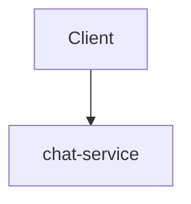

# FACTS PACK FOR CHAT-SERVICE

## Stack Meta
- **Detected Stack:** NODE_NESTJS
- **Service Path:** `backend/node-services/chat-service`

## Extracted Architecture Indicators

## Database Models
No database entities detected.

## Extracted API Routes
_No explicit HTTP annotations detected._

## Extracted Environment / Config Keys
- `process.env.DATABASE_URL_CHAT`
- `process.env.NODE_ENV`
- `process.env.PORT`

## Outbound Dependencies
_No outbound HTTP calls detected._
