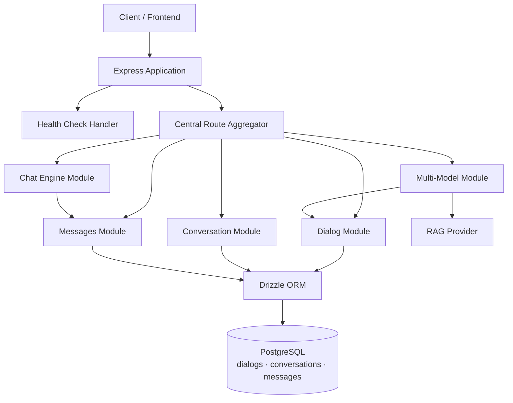
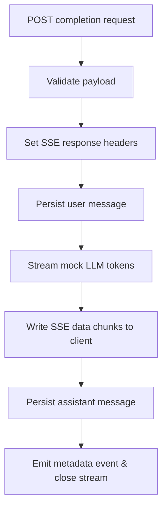

# Chat Service

The Chat Service is an Express-based TypeScript microservice that manages dialog configurations, conversation sessions, message history, and streaming chat completions (including multi-model RAG fan-out). It persists state in PostgreSQL via Drizzle ORM and exposes modular HTTP routers mounted from a central route aggregator [src: backend/node-services/chat-service/src/app.ts:L1-L28] [src: backend/node-services/chat-service/src/core/routes/index.ts:L1-L16].

## Overview

The service is organized into feature modules:

| Module | Responsibility |
|---|---|
| **Dialog** | CRUD for dialog (chat assistant) configuration — LLM settings, prompt config, knowledge-base references [src: backend/node-services/chat-service/src/core/database/schema.ts:L15-L37] [src: backend/node-services/chat-service/src/modules/dialog/dialog.routes.ts:L24-L44] |
| **Conversation** | Session lifecycle — init, list, update, soft-delete conversations tied to a dialog [src: backend/node-services/chat-service/src/core/database/schema.ts:L40-L53] [src: backend/node-services/chat-service/src/modules/conversation/conversation.routes.ts:L21-L43] |
| **Messages** | Message history retrieval, feedback updates, and parent/child pair deletion [src: backend/node-services/chat-service/src/core/database/schema.ts:L56-L82] [src: backend/node-services/chat-service/src/modules/messages/messages.routes.ts:L11-L24] |
| **Chat Engine** | SSE streaming completion — persists user prompt, streams mock LLM tokens, persists assistant response [src: backend/node-services/chat-service/src/modules/chat-engine/chat-engine.controller.ts:L9-L45] [src: backend/node-services/chat-service/src/modules/chat-engine/chat-engine.service.ts:L11-L48] |
| **Multi-Model** | Concurrent multi-model SSE completion with per-model events and dialog model selection [src: backend/node-services/chat-service/src/modules/multi-model/multi-model.routes.ts:L12-L22] [src: backend/node-services/chat-service/src/modules/multi-model/multi-model.service.ts:L43-L94] |
| **RAG Provider** | Async generator for token-chunk streaming with abort-signal support (mock implementation) [src: backend/node-services/chat-service/src/modules/rag-provider/rag-provider.service.ts:L12-L41] |

Cross-cutting infrastructure includes request validation (Yup schemas), async error wrapping, centralized error handling, Winston logging, and a singleton PostgreSQL connection pool [src: backend/node-services/chat-service/src/core/middleware/requestValidation.ts] [src: backend/node-services/chat-service/src/core/middleware/catchAsync.ts] [src: backend/node-services/chat-service/src/core/middleware/errorHandler.ts] [src: backend/node-services/chat-service/src/core/services/logger.service.ts] [src: backend/node-services/chat-service/src/core/database/index.ts:L9-L44].

## Framework & stack

| Layer | Technology |
|---|---|
| Runtime | Node.js with TypeScript (`ts-node` / compiled `dist/`) [src: backend/node-services/chat-service/package.json:L7-L9] |
| HTTP framework | Express 5 [src: backend/node-services/chat-service/package.json:L22] [src: backend/node-services/chat-service/src/app.ts:L1-L7] |
| ORM | Drizzle ORM with `pg` driver [src: backend/node-services/chat-service/package.json:L21-L23] [src: backend/node-services/chat-service/src/core/database/index.ts:L1-L44] |
| Validation | Yup [src: backend/node-services/chat-service/package.json:L25] |
| Logging | Winston [src: backend/node-services/chat-service/package.json:L24] |
| Testing | Jest + Supertest [src: backend/node-services/chat-service/package.json:L10-L12] |

> **Note:** `FACTS.md` reports the detected stack as `JAVA_SPRING_BOOT`, which does not match the Express/TypeScript implementation [src: backend/node-services/chat-service/docs/facts/FACTS.md:L4-L5].

## Dependencies

### NPM packages

| Package | Purpose |
|---|---|
| `express` | HTTP server and routing [src: backend/node-services/chat-service/package.json:L22] |
| `cors` | Cross-origin request handling [src: backend/node-services/chat-service/package.json:L19] [src: backend/node-services/chat-service/src/app.ts:L11] |
| `dotenv` | Environment variable loading [src: backend/node-services/chat-service/package.json:L20] [src: backend/node-services/chat-service/src/core/database/index.ts:L4-L7] |
| `drizzle-orm` / `drizzle-kit` | Schema definition, queries, migrations [src: backend/node-services/chat-service/package.json:L21] |
| `pg` | PostgreSQL connection pool [src: backend/node-services/chat-service/package.json:L23] |
| `winston` | Structured application logging [src: backend/node-services/chat-service/package.json:L24] |
| `yup` | Request body/param validation [src: backend/node-services/chat-service/package.json:L25] |

### Platform services (monorepo context)

Sibling backend services registered in the shared service registry:

| Service | Base URL |
|---|---|
| IdentityService | `http://identity-service:3000` |
| AdminService | `http://admin-auth-service:3000` |
| DatasetService | `http://dataset-service:3000` |
| DocumentService | `http://document-service:3000` |
| ParserService | `http://parser-service:3000` |

[src: backend/shared/services.json:L2-L8]

Chat Service is not listed in `backend/shared/services.json`.

## Architecture

### Streaming completion flow

Implemented in `ChatEngineController` and `ChatEngineService` [src: backend/node-services/chat-service/src/modules/chat-engine/chat-engine.controller.ts:L9-L45] [src: backend/node-services/chat-service/src/modules/chat-engine/chat-engine.service.ts:L11-L48].

## Related documentation

- [API Reference](./api-reference.md) — routes documented from `FACTS.md`
- [Configuration](./config.md) — environment variables from `FACTS.md`
- [Ground Truth Facts](./facts/FACTS.md) — authoritative facts pack

## ⚠️ To Verify

- [ ] Re-run `node tools/extract-facts.mjs backend/node-services/chat-service` after fixing stack detection (`JAVA_SPRING_BOOT` misidentified an Express service) so routes and env vars populate `FACTS.md` [src: backend/node-services/chat-service/docs/facts/FACTS.md:L4-L11].
- [ ] `system-architecture.json` was not found in the repository; global architecture context could not be loaded.
- [ ] Chat Service is absent from `backend/shared/services.json` — confirm intended service discovery entry [src: backend/shared/services.json:L2-L8].
- [ ] `.env.example` lists `DATABASE_URL` while runtime code reads `DATABASE_URL_CHAT` — reconcile before documenting config keys [src: backend/node-services/chat-service/.env.example:L1] [src: backend/node-services/chat-service/src/core/database/index.ts:L16].
- [ ] Route paths defined in Express routers and controllers are not present in `FACTS.md` and are therefore omitted from the API reference per documentation rules.
