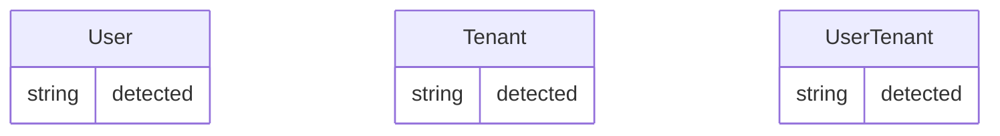

# FACTS PACK FOR IDENTITY-SERVICE

## Stack Meta
- **Detected Stack:** NODE_NESTJS
- **Service Path:** `backend/node-services/identity-service`

## Extracted Architecture Indicators
```mermaid
flowchart TD
    Client --> identity-service
    identity-service --> [(Database)]
```

## Database Models


## Extracted API Routes
- `@Post('register') in src/auth/auth.controller.ts`
- `@Post('login') in src/auth/auth.controller.ts`
- `@Post('refresh') in src/auth/auth.controller.ts`
- `@Post('logout') in src/auth/auth.controller.ts`
- `@Post(':tenantId/users') in src/tenants/tenant.controller.ts`
- `@Patch(':tenantId/users/:userId/role') in src/tenants/tenant.controller.ts`
- `@Delete(':tenantId/users/:userId') in src/tenants/tenant.controller.ts`
- `@Get('profile') in src/users/users.controller.ts`

## Extracted Environment / Config Keys
- `process.env.NODE_ENV`
- `process.env.REFRESH_COOKIE_MAX_AGE`
- `process.env.JWT_SECRET`
- `process.env.JWT_ACCESS_EXPIRATION`
- `process.env.FRONTEND_URL`
- `process.env.PORT`
- `process.env.DATABASE_URL`
- `process.env.REDIS_HOST`
- `process.env.REDIS_PORT`
- `process.env.REDIS_PASSWORD`

## Outbound Dependencies
_No outbound HTTP calls detected._
