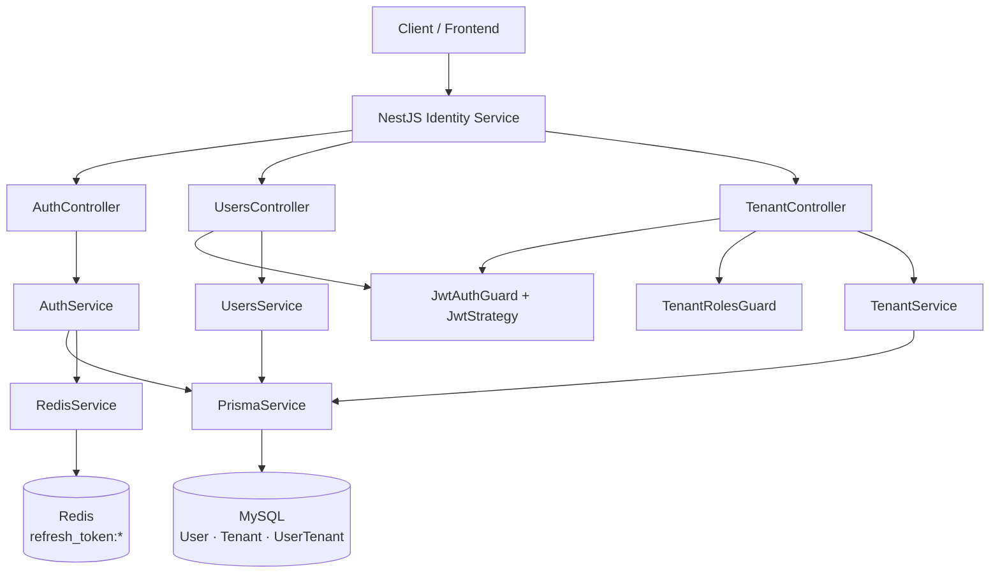
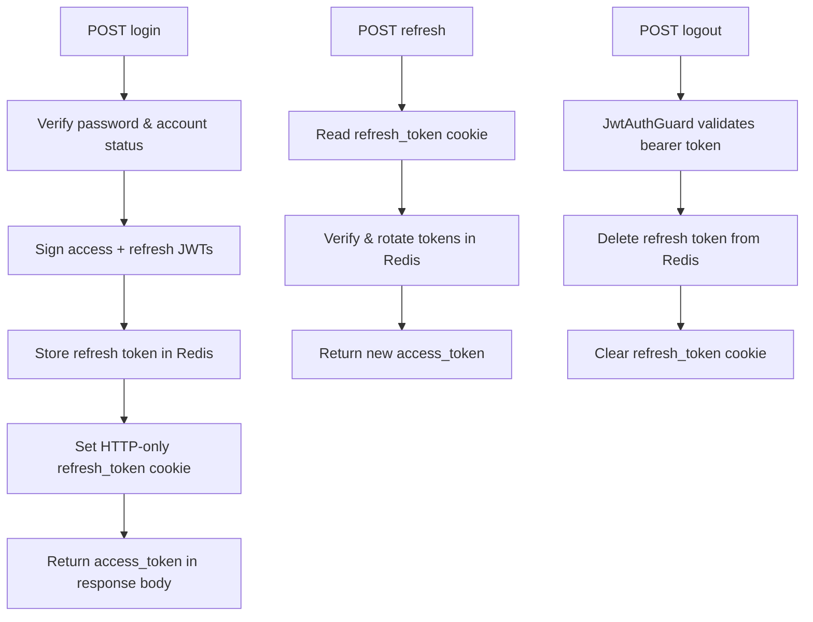

# Identity Service

The Identity Service is a NestJS microservice that provides centralized authentication and tenant management for the Ragflow platform. It exposes a versioned HTTP API, validates incoming requests, persists users and tenants in MySQL via Prisma, stores refresh tokens in Redis, and serves interactive API documentation via Swagger [src: backend/node-services/identity-service/src/main.ts:L6-L36] [src: backend/node-services/identity-service/docs/facts/FACTS.md:L4-L5].

## Overview

The service handles user registration and login, JWT access-token issuance, refresh-token rotation via HTTP-only cookies, session revocation on logout, authenticated user profile retrieval, and multi-tenant membership management [src: backend/node-services/identity-service/docs/facts/FACTS.md:L28-L36].

### Application modules

| Module | Responsibility |
|---|---|
| **AuthModule** | Registration, login, refresh, logout, JWT strategy [src: backend/node-services/identity-service/src/app.module.ts:L4] [src: backend/node-services/identity-service/src/auth/auth.controller.ts:L31-L32] |
| **UsersModule** | Authenticated user profile endpoint [src: backend/node-services/identity-service/src/app.module.ts:L5] [src: backend/node-services/identity-service/src/users/users.controller.ts:L21-L22] |
| **TenantModule** | Tenant creation and membership management [src: backend/node-services/identity-service/src/app.module.ts:L9] [src: backend/node-services/identity-service/src/tenants/tenant.controller.ts:L25-L26] |
| **PrismaModule** | Database connection lifecycle [src: backend/node-services/identity-service/src/app.module.ts:L7-L8] |
| **RedisModule** | Redis client for refresh-token storage [src: backend/node-services/identity-service/src/app.module.ts:L6] [src: backend/node-services/identity-service/src/redis/redis.module.ts:L8-L14] |

### Database models

`FACTS.md` identifies three Prisma models [src: backend/node-services/identity-service/docs/facts/FACTS.md:L16-L26]:

| Model | Purpose |
|---|---|
| **User** | Account credentials, status, and tenant memberships [src: backend/node-services/identity-service/prisma/schema.prisma:L21-L30] |
| **Tenant** | Named tenant organization [src: backend/node-services/identity-service/prisma/schema.prisma:L32-L38] |
| **UserTenant** | Join table linking users to tenants with a role [src: backend/node-services/identity-service/prisma/schema.prisma:L40-L50] |

## Framework & stack

| Layer | Technology |
|---|---|
| Runtime | Node.js with NestJS 11 [src: backend/node-services/identity-service/package.json:L27-L31] [src: backend/node-services/identity-service/docs/facts/FACTS.md:L4] |
| HTTP | `@nestjs/platform-express` [src: backend/node-services/identity-service/package.json:L31] |
| ORM | Prisma with MariaDB adapter [src: backend/node-services/identity-service/package.json:L33-L34] [src: backend/node-services/identity-service/prisma/schema.prisma:L1-L3] |
| Cache | Redis via `@nestjs-modules/ioredis` [src: backend/node-services/identity-service/package.json:L26] [src: backend/node-services/identity-service/src/redis/redis.module.ts:L8-L14] |
| Auth | JWT (`@nestjs/jwt`, `passport-jwt`), bcrypt password hashing [src: backend/node-services/identity-service/package.json:L29-L30] [src: backend/node-services/identity-service/package.json:L35] |
| Validation | `class-validator` global `ValidationPipe` [src: backend/node-services/identity-service/package.json:L37] [src: backend/node-services/identity-service/src/main.ts:L17] |
| API docs | Swagger at startup [src: backend/node-services/identity-service/package.json:L32] [src: backend/node-services/identity-service/src/main.ts:L25-L36] |

## Dependencies

### NPM packages

| Package | Purpose |
|---|---|
| `@nestjs/common`, `@nestjs/core`, `@nestjs/platform-express` | NestJS framework [src: backend/node-services/identity-service/package.json:L27-L31] |
| `@prisma/client`, `@prisma/adapter-mariadb`, `mysql2` | Database access [src: backend/node-services/identity-service/package.json:L33-L34] [src: backend/node-services/identity-service/package.json:L41] |
| `@nestjs-modules/ioredis`, `ioredis` | Refresh-token storage [src: backend/node-services/identity-service/package.json:L26] [src: backend/node-services/identity-service/package.json:L40] |
| `@nestjs/jwt`, `@nestjs/passport`, `passport-jwt` | JWT signing and validation [src: backend/node-services/identity-service/package.json:L29-L30] [src: backend/node-services/identity-service/package.json:L43-L44] |
| `bcrypt` | Password hashing [src: backend/node-services/identity-service/package.json:L35] |
| `cookie-parser` | Refresh-token cookie parsing [src: backend/node-services/identity-service/package.json:L38] [src: backend/node-services/identity-service/src/main.ts:L9] |
| `@nestjs/swagger`, `swagger-ui-express` | OpenAPI documentation [src: backend/node-services/identity-service/package.json:L32] [src: backend/node-services/identity-service/package.json:L46] |

### Platform services (monorepo context)

| Service | Base URL |
|---|---|
| IdentityService | `http://identity-service:3000` |
| AdminService | `http://admin-auth-service:3000` |
| DatasetService | `http://dataset-service:3000` |
| DocumentService | `http://document-service:3000` |
| ParserService | `http://parser-service:3000` |

[src: backend/shared/services.json:L2-L8]

`FACTS.md` reports no outbound HTTP dependencies [src: backend/node-services/identity-service/docs/facts/FACTS.md:L50-L51].

## Architecture

### Authentication flow

Implemented in `AuthController` and `AuthService` [src: backend/node-services/identity-service/src/auth/auth.controller.ts:L44-L108] [src: backend/node-services/identity-service/src/auth/auth.service.ts:L43-L156].

## Related documentation

- [API Reference](./api-reference.md) — routes documented from `FACTS.md`
- [Configuration](./config.md) — environment variables from `FACTS.md`
- [Ground Truth Facts](./facts/FACTS.md) — authoritative facts pack

## ⚠️ To Verify

- [ ] `@Post()` tenant creation handler in `TenantController` is not listed in `FACTS.md` [src: backend/node-services/identity-service/src/tenants/tenant.controller.ts:L30-L31] [src: backend/node-services/identity-service/docs/facts/FACTS.md:L28-L36].
- [ ] Root `@Get()` health handler on `AppController` is not listed in `FACTS.md` [src: backend/node-services/identity-service/src/app.controller.ts:L7-L9].
- [ ] `system-architecture.json` was not found in the repository; global architecture context could not be loaded.
- [ ] Full resolved URL paths (global prefix + version + controller path) are not present in `FACTS.md` and are therefore omitted from the API reference.
