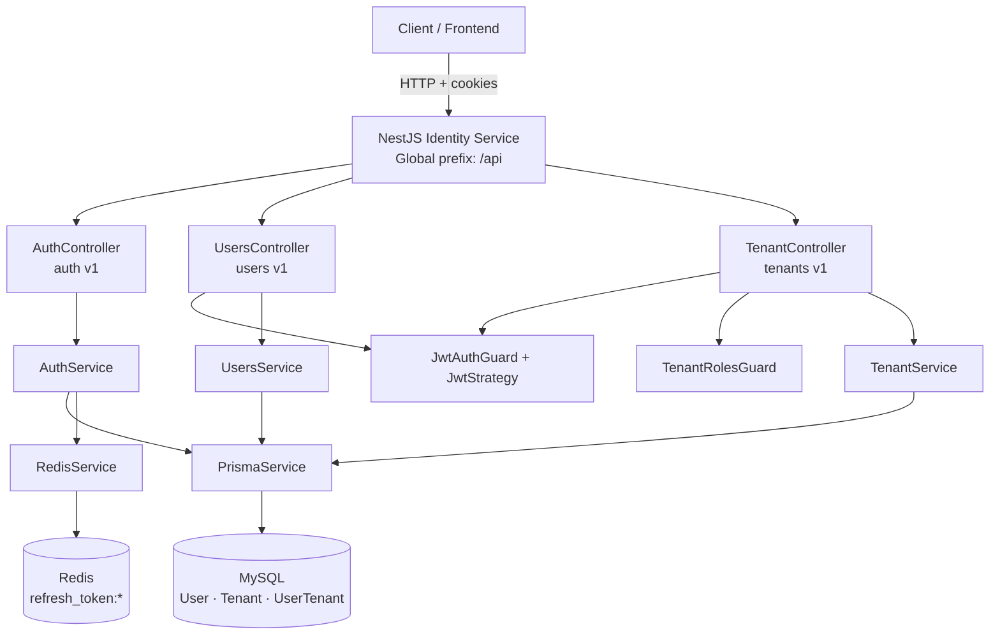
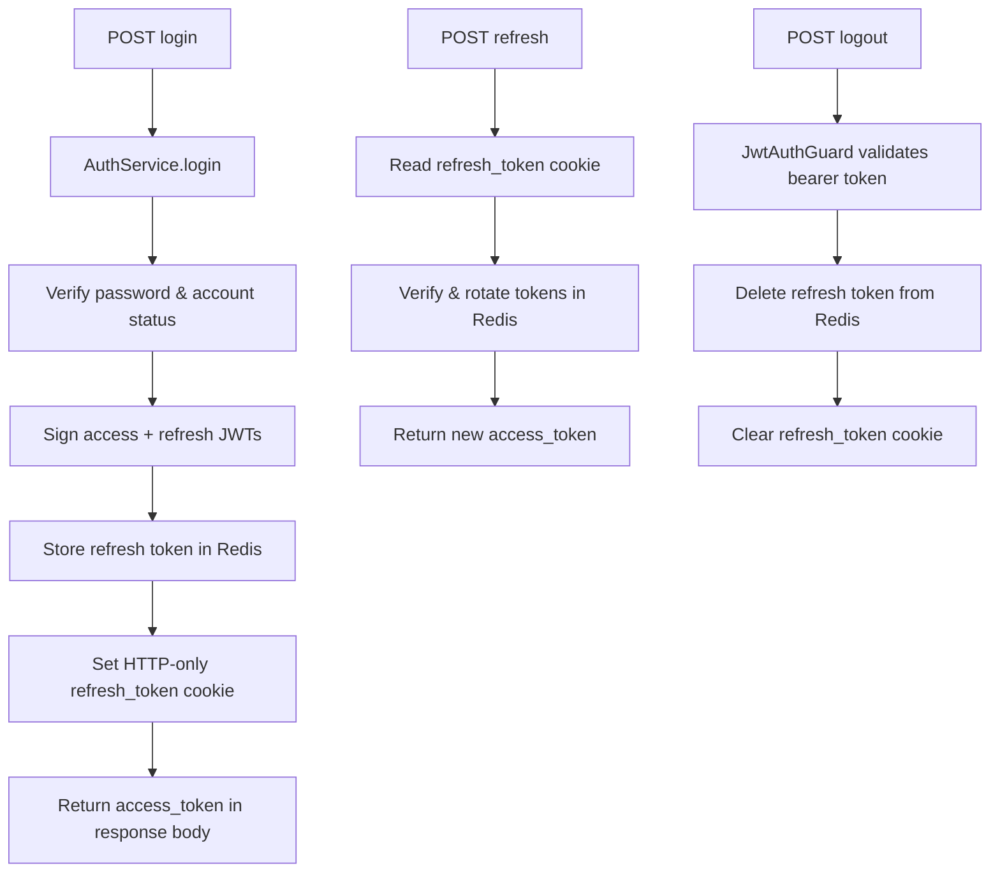

# Identity Service

The Identity Service is a NestJS microservice that provides centralized authentication and tenant management for the Ragflow platform. It exposes a versioned HTTP API under the `/api` global prefix, validates incoming requests, and serves interactive API documentation via Swagger at `/api/docs` [src: backend/node-services/identity-service/src/main.ts:L19-L36].

## Overview

The service handles user registration and login, JWT access-token issuance, refresh-token rotation via HTTP-only cookies, session revocation on logout, user profile retrieval, and multi-tenant membership management (create tenant, invite users, update roles, remove members) [src: backend/node-services/identity-service/src/auth/auth.controller.ts:L35-L108] [src: backend/node-services/identity-service/src/users/users.controller.ts:L25-L47] [src: backend/node-services/identity-service/src/tenants/tenant.controller.ts:L29-L79].

Persistent state is stored in a MySQL database accessed through Prisma, with models for `User`, `Tenant`, and `UserTenant` membership links [src: backend/node-services/identity-service/prisma/schema.prisma:L21-L50]. Refresh tokens are stored in Redis with a seven-day TTL to support token rotation and logout invalidation [src: backend/node-services/identity-service/src/redis/redis.service.ts:L9-L19].

## Dependencies

### Runtime stack

| Dependency | Role |
|---|---|
| NestJS (`@nestjs/common`, `@nestjs/core`, `@nestjs/platform-express`) | HTTP server, modules, guards, and dependency injection [src: backend/node-services/identity-service/package.json:L27-L31] |
| Prisma (`@prisma/client`, `@prisma/adapter-mariadb`) | ORM and MariaDB/MySQL adapter for user and tenant data [src: backend/node-services/identity-service/package.json:L33-L34] [src: backend/node-services/identity-service/src/prisma/prisma.service.ts:L3-L27] |
| Redis (`@nestjs-modules/ioredis`, `ioredis`) | Refresh-token storage and session invalidation [src: backend/node-services/identity-service/package.json:L26] [src: backend/node-services/identity-service/src/redis/redis.module.ts:L11-L13] |
| JWT / Passport (`@nestjs/jwt`, `@nestjs/passport`, `passport-jwt`) | Access-token signing and bearer-token validation [src: backend/node-services/identity-service/package.json:L29-L30] [src: backend/node-services/identity-service/src/auth/jwt.strategy.ts:L23-L27] |
| bcrypt | Password hashing on registration and verification on login [src: backend/node-services/identity-service/package.json:L35] [src: backend/node-services/identity-service/src/auth/auth.service.ts:L30-L31] [src: backend/node-services/identity-service/src/auth/auth.service.ts:L61-L63] |
| cookie-parser | Parsing HTTP-only refresh-token cookies [src: backend/node-services/identity-service/package.json:L38] [src: backend/node-services/identity-service/src/main.ts:L9] |
| Swagger (`@nestjs/swagger`, `swagger-ui-express`) | OpenAPI documentation UI [src: backend/node-services/identity-service/package.json:L32] [src: backend/node-services/identity-service/src/main.ts:L25-L36] |
| class-validator / class-transformer | Request DTO validation via global `ValidationPipe` [src: backend/node-services/identity-service/package.json:L36-L37] [src: backend/node-services/identity-service/src/main.ts:L17] |

### Application modules

| Module | Responsibility |
|---|---|
| `AuthModule` | Registration, login, refresh, logout, JWT strategy [src: backend/node-services/identity-service/src/app.module.ts:L4] [src: backend/node-services/identity-service/src/auth/auth.controller.ts:L31-L32] |
| `UsersModule` | Authenticated user profile endpoint [src: backend/node-services/identity-service/src/app.module.ts:L5] [src: backend/node-services/identity-service/src/users/users.controller.ts:L21-L22] |
| `TenantModule` | Tenant creation and membership management [src: backend/node-services/identity-service/src/app.module.ts:L9] [src: backend/node-services/identity-service/src/tenants/tenant.controller.ts:L25-L26] |
| `PrismaModule` | Database connection lifecycle [src: backend/node-services/identity-service/src/app.module.ts:L7-L8] [src: backend/node-services/identity-service/src/prisma/prisma.service.ts:L30-L35] |
| `RedisModule` | Redis client configuration [src: backend/node-services/identity-service/src/app.module.ts:L6] [src: backend/node-services/identity-service/src/redis/redis.module.ts:L11-L13] |

## Architecture

### Request flow (authentication)

These flows are implemented in `AuthController` and `AuthService` [src: backend/node-services/identity-service/src/auth/auth.controller.ts:L44-L108] [src: backend/node-services/identity-service/src/auth/auth.service.ts:L43-L156].

## Related documentation

- [API Reference](./api-reference.md) — routes documented from `FACTS.md`
- [Configuration](./config.md) — environment variables from `FACTS.md`
- [Ground Truth Facts](./facts/FACTS.md) — authoritative facts pack

## ⚠️ To Verify

- [ ] `system-architecture.json` was referenced in the documentation workflow but was not found in this repository; global system context could not be incorporated.
- [ ] `FACTS.md` lists no API routes in its routes table, so endpoint paths are not documented in the API reference despite controllers defining handlers in source code.
- [ ] Swagger is mounted at `/api/docs`, which is not listed in `FACTS.md` [src: backend/node-services/identity-service/src/main.ts:L36].
- [ ] The root health endpoint (`AppController` `@Get()`) returns a plain string and is not listed in `FACTS.md` [src: backend/node-services/identity-service/src/app.controller.ts:L7-L9].
