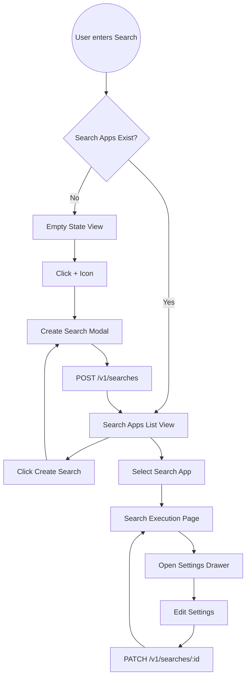
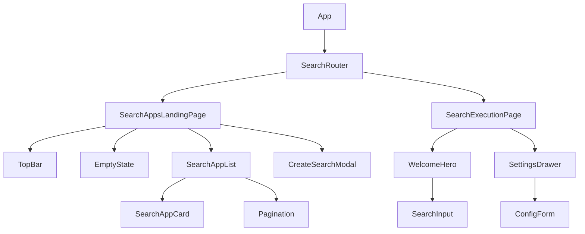

# Search Frontend Low-Level Design (LLD)

## 1. Overview
The Search Frontend is a module within the React rewrite of the RAGFlow application. It provides a user interface for managing "Search Apps" (saved search configurations) and interacting with the search execution engine.

### Primary Goals
- Provide a seamless flow from "Empty State" $\rightarrow$ "Search App Creation" $\rightarrow$ "Search Interaction".
- Allow users to manage search configurations (datasets, thresholds, models) via an intuitive side-drawer.
- Maintain strict architectural boundaries as per the project's React guidelines.

---

## 2. Technical Architecture

### Directory Structure
Following the `@modules` pattern, the search application will reside in `src/modules/search`.

```text
src/modules/search/
├── api/
│   └── searchApi.ts          # Axios calls to the search-service (v1/searches)
├── components/
│   ├── SearchApps/
│   │   ├── EmptyState.tsx     # Centered "No search app created" view
│   │   ├── SearchAppList.tsx  # Grid/List of search app cards
│   │   ├── SearchAppCard.tsx  # Individual search app item
│   │   └── CreateSearchModal.tsx # Modal for creating a new search app
│   └── Execution/
│       ├── WelcomeHero.tsx    # "Hi there, welcome back..." centered UI
│       ├── SearchInput.tsx    # The "How can I help you today?" search box
│       └── SettingsDrawer.tsx # Right-side configuration drawer
├── hooks/
│   ├── useSearchApps.ts       # Hook for fetching/filtering/paginating search apps
│   └── useSearchConfig.ts     # Hook for creating/updating specific app configs
├── pages/
│   ├── SearchAppsLandingPage.tsx # Main landing (Empty state vs List state)
│   └── SearchExecutionPage.tsx   # Internal page for a specific search app
└── types/
    └── search.types.ts        # TypeScript interfaces for SearchConfiguration and API responses
```

---

## 3. Functional Design

### 3.1 Search Apps Landing Page (`SearchAppsLandingPage`)
This page acts as the gateway to the search feature. It has two primary states.

#### State A: Empty State
- **UI**: Centered layout.
- **Content**: "No search app created yet" message.
- **Action**: A large `+` icon that triggers the `CreateSearchModal`.

#### State B: Populated State
- **Top Bar**:
    - Left: "Search apps" heading.
    - Right: A search filter input and a "Create search" button.
- **Content**: A list/grid of `SearchAppCard` components showing the app name and creation date.
- **Footer**: Pagination controls (Total count, Page navigation, Page size selector).

### 3.2 Create Search Modal (`CreateSearchModal`)
A modal interface to define a new search app.
- **Inputs**: App Name, initial configuration settings.
- **Action**: API call to `POST /v1/searches`.

### 3.3 Search Execution Page (`SearchExecutionPage`)
Accessed when a user selects a search app from the landing page.

#### Central Area (Hero)
- **Welcome Message**: "👋 Hi there, Welcome back, [User Name]".
- **Search Feature**: A centered, prominent search input with the placeholder "How can I help you today?".

#### Configuration Side Drawer (`SettingsDrawer`)
A slide-out panel on the right side for updating the search app's behavior.
- **Header**: "Search settings".
- **Configuration Fields**:
    - **Name**: Editable text field.
    - **System Prompt**: Text area for the assistant's persona.
    - **Datasets**: Multi-select dropdown to choose knowledge bases.
    - **Chunk Metadata**: Toggle switch to show/hide metadata.
    - **Similarity Threshold**: Range slider (0.0 to 1.0).
    - **Similarity Weights**: Split slider for "Vector" vs "Full-text" weight.
    - **Toggles**: Rerank model, AI summary, Related search, Query mindmap.
- **Actions**: "Cancel" and "Save" buttons.

---

## 4. Data Flow & API Integration

### API Endpoints (`searchApi.ts`)
| Action | Endpoint | Method | Description |
| :--- | :--- | :--- | :--- |
| Fetch Apps | `/v1/searches` | `GET` | Get paginated list of apps for the user |
| Create App | `/v1/searches` | `POST` | Create new search configuration |
| Get Config | `/v1/searches/:id` | `GET` | Fetch specific app settings |
| Update Config| `/v1/searches/:id` | `PATCH` | Update app configuration |

### State Management
- **Server State**: Managed by **TanStack Query** (`useQuery`, `useMutation`) for caching the search apps list and handling the "Save" actions in the settings drawer.
- **Local UI State**: Managed via `useState` for the search filter text, modal visibility, and drawer open/closed state.

---

## 5. Diagrams

### 5.1 Page Navigation Flow


### 5.2 Component Hierarchy

